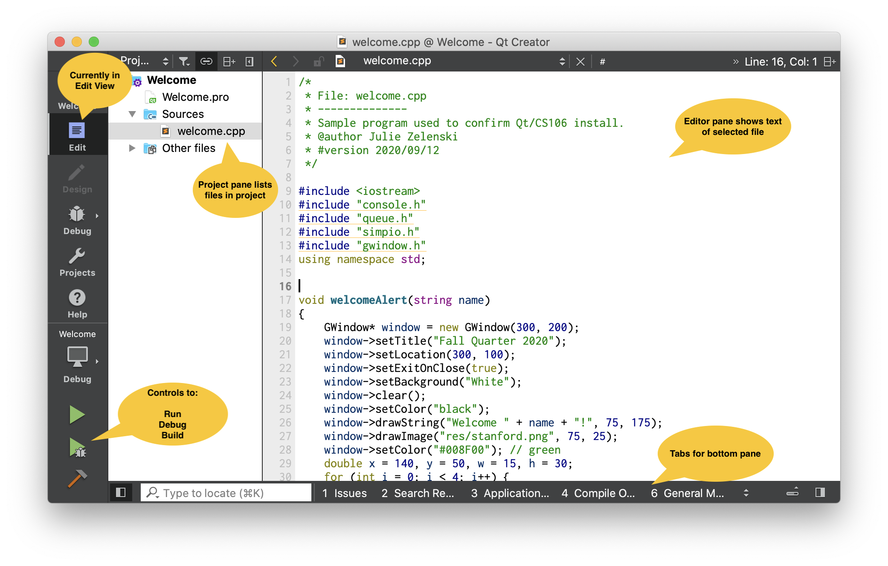

### Basic of using Qt Creator

***

- **Opening a project**

  Each Qt Creator project includes a file named with a `.pro` extension. To open a project in Qt Creator, you may either:

  - Double-click the `.pro` file in the Finder/File Explorer.
  - In the Qt Creator application, choose menu File->Open File or Project, navigate to the project folder and choose the `.pro` file to open.

  Note that opening a source file (i.e. `life.cpp`) opens that single file. Instead you want to open the pro file (`life.pro`) to get access to the entire project.

- **The Qt Creator window**

  Below is a screenshot of a project open in Qt Creator.

  

  **View options** The icons in the upper part of leftmost edge are the "View" options. A project opens in "Edit" view and the main pane of the window is used for editing your source files. Another view you will often use is the "Debug" view, which using the main pane of the window for the debugger controls.

  **Project pane** is to the right of the View options. It display a hierarchical listing of the project files. The file currently selected for editing is highlighted. Your code files for the project are listed in the `Sources` folder. The `Other files` folder contains non-code project resources such as data files, images, and sounds.

  **Build-run controls** are in the lower left. Click the hammer icon to build the program. If the project successfully builds, click the play button (plain green triangle) to run the program. To run the program under the debugger, click the debug button which is the green triangle with a bug on it.

  **Output pane tabs** are along the bottom edge. At the bottom of the window, there are named tabs for "Issues", "Application Output", and "Compiler Output". Click one of these tabs to show the corresponding information in the lower pane. Sometimes the explanations in the "Issues" pane are too terse to be helpful. In these cases, looking at the "Compile Output" or "Application Output" panes will provide more verbose and possibly helpful additional details.

- **Qt debugger**

  Check out the [debugger tutorial](./DebuggerTutorial.pdf) from CS106B Assignment 0.

