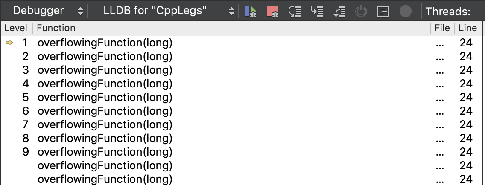
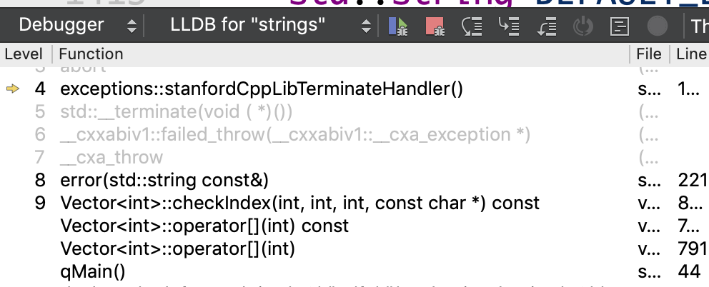

### Common Build/Run/Debug Issues

***

This page contains a list of common issues students may encounter when trying to build, run, or debug their code. If you're stuck on an issue, try searching this page using Ctrl+F (Command+F on Mac) to jump quickly to the text matching the error message or description of the issue you are having. You can also check out the [Qt troubleshooting guide](./Troubleshooting_Qt_Creator_project_issues.md) if you're having issues with Qt Creator.

- **If you're emailing or posting your issue on Ed**

  First of all, please make sure you've searched through this guide as well as the existing posts on Ed. Often you'll see that a similar problem has already been raised and resolved, and this will reduce your time spent waiting on a response. Also, don't forget that error messages can often be found online, so try using your favorite search engine to look up your error message to see what the Wisdom of the Internets has to say.

  If you are unable to find your issue either below, on Ed, or on the Internet, then here's what you should include in your Ed post/email:

  - **What steps you've taken to find the bug**: This might be walking through the debugger or using `cout` statements or constructing targeted test cases to narrow in on it.
  - **A specific question**: We generally will not simply debug your code for you, so please be specific on the issue you're having. What tests cases are triggering the bug? What line or lines specifically seem to be causing a failure? What have you tried to do to diagnose the bug so far?
  - **The error message**: Please include the specific error message from the Application Output or Compiler Output tab, if there is one.
  - **A code snippet**:
    - If posting your code on Ed, make sure the post is **private**.
    - **Do not paste images or screenshots** of your code/error messages, **instead copy and paste the text** into your post.
    - Neatly format your code, using the runnable or non-runnable code formatter on Ed.
    - Please don't include your entire file, isolate to the portion of the code that is relevant to the error.

- **Build warnings and errors**

  > **Build warnings: I get tons of yellow warning flags all over my code, including for code in the library that I did not write myself.**
  >
  > - Recent versions of Qt Creator have added a feature called a "code model" that performs style checking on your code as you write it. This is sometimes useful, but we think the checker is too picky and gives warnings about code that is not dangerous. You can safely ignore these unnecessary warnings. If you'd like to make the warnings go away, change the Analyzer to our [Qt Creator Recommended Settings](./Recommended_Settings_for_Qt_Creator.md).
  >
  > **Build error: Build progress meter is solid red, `QFileSystemEngine::currentPath: getcwd() failed`**
  >
  > - On macOS, this error indicates that Qt Creator was prevented from accessing the project files because the application lacks the needed privileges. In order to build a project, Qt Creator needs to be able to read and write files. You can grant Qt Creator access by agreeing when you get an alert such as this one:
  >
  >   
  >
  >   You can also go to "System Preferences" -> "Security & Privacy" -> "Privacy" tab -> "Files and Folders" to review and change what access has been granted to individual applications.
  >
  > **Build error: `use of undeclared identifier`**
  >
  > - This means you're either using a variable or calling a function that has not yet been defined. Double-check that there's not a typo, and also make sure that you've added function declarations at the top of your file before you call them (or that they're declared in your header file).
  >
  > **Build error: `symbol(s) not found for architecture x86_64` or `linker command failed with exit code 1`**
  >
  > - 
  >
  >   This means that your code calls a function that was never defined. This could indicate there is a typo in the function name or mismatch in the number or type of parameters. You may also have two identical function definitions, or you modified the definition of a provided function (look through the assignment handout and make sure you're not redefining functions you're not supposed to!). To get more information, click on the `Compile Output` tab near the bottom of the screen, and look through the output to find the name of the function(s) that is undefined so you know where to look to find the error.
  >
  >   
  >
  > **Build error: `Duplicate symbol for architecture x86_64`**
  >
  > - This indicates you have two or more definitions of the same function. Each function should have only one definition. To get more information about the error, click on the `Compile Output` tab near the bottom of the screen and look through the output to find the name of the duplicate function(s). This could mean you mistakenly copy/pasted the definition twice or you added the same file to the project more than once. If the problem is the latter, your best bet is to **re-initialize the project** to reset all files.
  >
  > **Build error: Terse, cryptic message in `Issues` tab, e.g. `Error`**
  >
  > - What is reported in the `Issues` tab may be terse and/or unhelpful. Instead click the bottom `Compile Output` tab to view more detailed information about the build activity. Use these additional details to further diagnose the problem.
  >
  > **Build error: Generic build error, e.g. `Error 1` or `Error 2` or `copyResources Error 4`**
  >
  > - Be sure to check in the `Compile Output` tab for additional details that might further diagnose the problem.
  >
  >   One common cause of generic build errors is having stored your project in a directory whose name includes certain disallowed punctuation (like parentheses) or international characters (e.g. Chinese, Korean, etc.) Try moving your project into a simple folder name containing only English characters, and then **re-initialize your project**.
  >
  > **Build error: `function declared in block scope cannot have 'static' storage class` or `function definition is not allowed here`**
  >
  > - This means you have a mismatched set of curly braces (i.e. `{` and `}`), so your compiler thinks your functions following this mismatch are being defined inside another function. It may be easier to see where this mismatch is if you auto-indent your code (by selecting all with Ctrl-A/Command-A and indenting with Ctrl-I/Command-I).
  >
  > **Build error: `no matching member function for call to '[function name].'` or `candidate function not viable: no known conversion...` or `no matching function for call to... '[function name]'`**
  >
  > - This means you're calling a function with different parameters from what it's designed to handle. If this is a function you've written, make sure you're calling it with the parameters that you've defined it to take. If this is a library function, you might want to double check the documentation for [C++ Standard library functions](http://en.cppreference.com/) or [Stanford library functions](https://web.stanford.edu/dept/cs_edu/resources/resources/docs/).
  >
  > **Build error: `type of parameter of declaration does not match definition...`**
  >
  > - This means the type of parameters in the function definition differs from the types in the earlier function declaration. Make sure you're using the same parameters and parameter types that you've defined (especially pay attention to whether or not parameters are passed by reference!).
  >
  > **Build warning: `control may reach end of non-void function`**
  >
  > - This indicates that you may not be returning in all possible cases in a function. If you're returning inside `if` statements, make sure you're returning something in every `else` case.
  >
  > **Build warning: `loop will run at most once`**
  >
  > - This usually shows up when you're returning inside of a `for` or `while` loop without condition checking. Remember that as soon as you hit a `return` statement, you'll exit the function, so if you have a loop with an unconditional `return` statement inside, the loop will only run the first iteration before hitting the `return` and exiting the function.
  >
  > **Build error: `invalid operands to binary expression in EXPECT_EQUAL`**
  >
  > - The longer form of this error message gives additional information:
  >
  >   ```c++
  >   testing/TestDriver.h:145:16: error: invalid operands to binary expression ('const Vector<int>' and 'const int')
  >     return lhs == rhs;
  >            ~~~ ^  ~~~
  >   In instantiation of function template specialization '_areEqual<Vector<int>, int>' requested here
  >     EXPECT_EQUAL(vec, num);
  >   ```
  >
  >   This error indicates that your code is mis-using `EXPECT_EQUAL`. The arguments to `EXPECT_EQUAL` must be two values that can be compared using `==`. The above use of `EXPECT_EQUAL` attempts to compare a `Vector<int>` to a single number; this is illegal.
  >
  > **Build warning: `comparison of integers of different signs: int and unsigned long`**
  >
  > - In C++, values that represent sizes use the special type `size_t`, which is an `unsigned` data type. The regular `int` type, in contrast, is `signed`. Although the two types can largely be treated the same, the compiler flags comparison with warning. Setting aside the mysteries of `signed` and `unsigned` representation to be revealed in CS107, it's enough to know that it is okay to ignore this particular warning.
  >
  >   If the warning irks you, you can configure Qt Creator to hush up about it. Edit the `Code Model` preferences to suppress sign comparison warnings following these steps:
  >
  >   - Go to `Qt Creator->Preferences`.
  >   - Choose `{} C++`.
  >   - Select the tab labeled `Code Model`.
  >   - Click `Manage.`
  >   - Click `Copy`.
  >   - Add `-Wno-sign-compare `to the text box.
  >   - Click `OK`.
  >   - Select `Checks for questionable constructs (Copy)` to the right of `Manage.`
  >   - Click `OK`.

- **Runtime errors**

  > **Runtime error: My program abruptly halts during execution. Error: `Runtime Error` or `Application has unexpectedly quit` or` Runtime terminated in an unusual way` or `The program has unexpectedly finished` or `The process was ended forcefully`**
  >
  > - This means the program has "crashed" or exited due to an error during execution. This generally means the program has a bug that attempts an illegal operation or causes an exception to be thrown. Clicking the `Application Output` tab might provide some additional information and a more specific error for why your program crashed – **make sure to read the error message** occurring after `An ErrorException occurred during program execution`.
  >
  >   The best way to proceed on diagnosing an execution error is to **use the debugger**. Instead of clicking the plain green triangle "Play" to run your program, click the green triangle with a bug on it. This runs your program under the debugger. When your program encounters the error which caused the problem, your program will stop in the debugger and show you where in your code the crash occurred.
  >
  >   The CS106B Assignment 0 [debugger tutorial](./DebuggerTutorial.pdf) introduces various strategies about how to use of the debugger – we highly recommend working through the tutorial if you have not already!
  >
  >   One possible reason for a program crashing is due to a stack overflow, which is what happens if a recursive function calls itself too many times (you can tell this if you open the debugger and see the same function name repeatedly in your stack frames):
  >
  >   
  >
  > **Runtime error: `basic_string::erase: __pos > this->size()`**
  >
  > - This means you're trying to erase at an index that is not valid for the string. Try running under the debugger or using `cout` statements to understand why your code is attempting to erase at an index out of bounds of the size of the string (remember that strings are zero-indexed!).
  >
  > **Runtime error: `Vector::operator []: index of [some number] is outside of valid range`**
  >
  > - This indicates that you're indexing at some value in a Vector that's not a valid index for the size of the Vector. Try running under the debugger or using `cout` statements to understand why your code is indexing at a value that is out of bounds (perhaps check if you're going out of bounds in a loop). Don't forget that Vectors are zero-indexed!
  >
  > **Runtime error: `A segmentation fault (SIGSEGV) occurred during program execution.`**
  >
  > - This indicates that you're dereferencing a pointer that is null or invalid. If you're not working with pointers, it's probably that you have some code that is creating a problem so that the underlying function you are calling fails. If you run the code in the debugger, the debugger should stop where the code crashes. It will possibly be in a function you didn't write (but that doesn't mean you didn't cause the issue). If that is the case, you can look down in the "Debugger" window at the bottom, and click on function names, going down the list until you find your own code.
  >
  >   
  >
  >   If you're working with recursion, this can also sometimes happen when you have a stack overflow, which is what happens if a recursive function calls itself too many times. (This can sometimes also cause the debugger to not be able to catch the crash.) Double check that your recursive functions will always eventually reach their base cases.

- **Help! It still doesn't work!**

  If you had read through the list of known fixes and were not able to resolve your issue, we will try our best to help you figure it out. Come by LaIR and show us the problem or make a post on Ed to ask for help. In your post, be sure to follow the **directions above**.

  Thanks, and good luck! You can do it!

