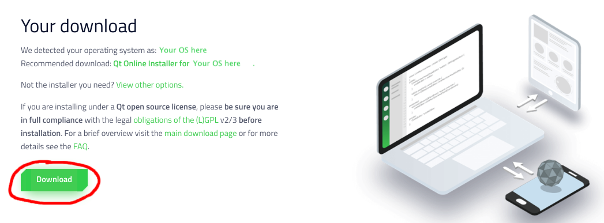
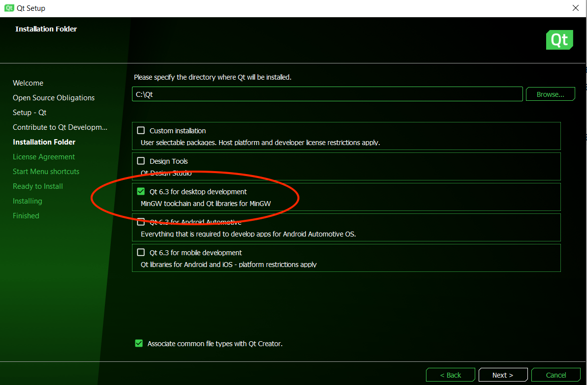
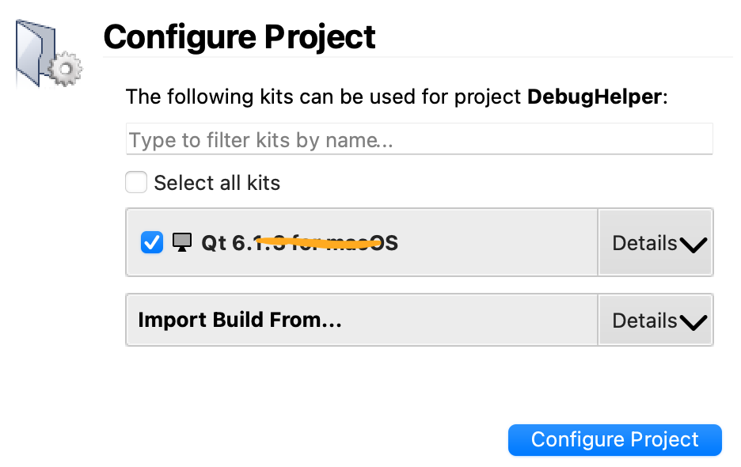

### Install Qt Creator on Windows

***

- **Download the Qt installer**

  Download the Qt installer from its official download site at https://www.qt.io/download-qt-installer. The site should detect that your computer is running Windows and recommend "Qt Online Installer for Windows". Click the green **"Download"** button to download the installer.

  

- **Run the Qt Installer**

  The downloaded installer is named something like `qt-unified-windows-x64-4.4.1-online `. Double-click to run it.

  The Qt installer will walk you through a set of steps. For most steps, you can use the default settings and simply click **"Next"** or **"Agree"** to move on, with the following exceptions:

  - At the `Welcome` step, sign up (or sign in) for your own Qt Account. Go ahead and put in your @stanford.edu email and verify your account via email. When setting up your account, you do not have to put in your phone number or city.
  - Register as an individual user, not as part of a company / organization and not for commercial use.
  - At the `Installation Folder` step (see screenshot below):
    - Select the option **Qt 6.x for desktop development**, MinGW toolchain and Qt libraries for MinGW.
    - Do **not change** the name or location of the directory where Qt will be installed.

  

  If you don't see **Qt 6.x for desktop development** as an option, please ping us on Ed and we'll be happy to help out.

- **Install CS106-specific package**

  After installing Qt, you must **install the CS106-specific package** and do a **complete build and run cycle** to confirm all is working properly.

  **Download CS106 package and extract**

  - Download this archive file: 📦 [CS106.zip](./CS106.zip)
  - Un-zip the download contents (on a Windows computer, click "Extract all") to a location of your choice. You should have a folder named `CS106` with several files and folders inside.

  **Open and configure CS106 project**

  A Qt Creator project includes a file named with a `.pro` extension. Double-clicking the `.pro` file opens the project in Qt Creator.

  - Find the `CS106.pro` file and open it now.
    - If your Windows File Explorer options are set to hide filename extensions, the file `CS106.pro` will display the name `CS106`. You can change whether extensions are displayed in File Explorer by choosing menu item File->Options, select the "View" tab and under “Advanced settings”, uncheck "Hide extensions for known file types". Click "Apply" button.
    - When opening a project for the first time, Qt Creator will ask you to configure the project build kit. The "Configure Project" panel shows the list of available build kits (see screenshot below). The default kit should already be selected; it will match the desktop kit you selected when installing Qt Creator (version **Qt 6.x.x**).
    - Accept the default by clicking the "Configure Project" button.

  

  If your Qt Creator shows no kits are available, review the [Qt install instructions](./Resources_for_Qt_Creator.md). You can repeat the steps to re-install Qt if you missed selecting the correct option.

- **Build the program**

  C++ code must be *compiled* or *built* before it is run; this means converting the source code into executable binary code.

  - Click the Build icon  in the lower-left of the Qt Creator window.
  - Watch the build progress meter  in the lower-right. The first time you build a project, it can take a minute or more to compile the library code. When the bar turns green, it indicates the program successfully built.

  **Run the program**

  Now that the program is built, you are ready to run it.

  - Click the Play/Run icon  in lower-left of window.

  - As shown in the screenshot below, the welcome program prints a message to the console window and draws the Stanford logo on graphics window.

    

  ✔️ Congratulations, **your installation is good to go**! You may now discard the CS106 project, you will not need it again.

- **Configure settings(optional)**

  For a better experience, we suggest changing some of the default settings, see our [recommended configuration settings](./Recommended_Settings_for_Qt_Creator.md).

