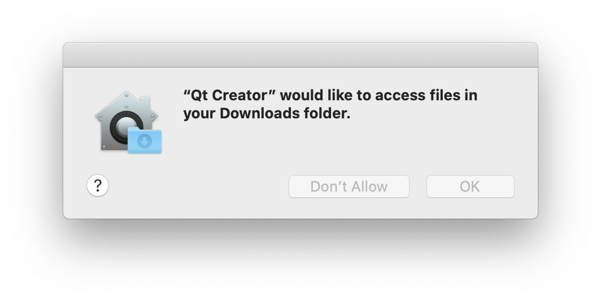

### Troubleshooting Qt Creator project issues

***

This page contains information on how to resolve common problems with Qt Creator projects. Consider searching this page using Ctrl+F (Command+F on Mac) to jump quickly to the text matching the error message or issue you are having. You may also want to check the [Guide to Common Build/Run/Debug problems](./Common BuildRunDebug Issues.md) if for issues compiling or running your program.

- **How to "re-initialize" a Qt Creator project**

  A large number of Qt Creator ills can be resolved by following these steps to re-initialize your project. (Please note that this requires deleting some files from your project. Be careful not to delete your assignment solution code. Make frequent backups of your files.)

  - Quit Qt Creator.
  - Navigate to the folder where your project is stored. Identify the file with the extension `.pro.user`, such as `Life.pro.user` and delete it. **Take care**: You want to delete only the file with exactly the `pro.user` extension , not the other similarly-named files such as `Life.pro` ([screenshot](./image/qtcreator-pro-user-file.png))
  - Also find the "build" folder for your project and delete it. The build folder is located in the parent directory of your project folder, and has a long name like `build-Life-Desktop_Qt_6_x_x_kit_xxbit-Debug`. Delete the entire build folder. ([screenshot](./image/qtcreator-build-dir.png))
  - Re-start Qt Creator. Open the `.pro` file of your project and Qt should ask you to "Configure Project", just as if you were opening for the first time.
  - Now try to build and run to see if things work any better.
  
- **Installation woes**

  > **I installed Qt Creator previously. Must I reinstall or can I use my existing installation?**
  >
  > - You should install the latest. Our projects are written to work with the latest version and the most recent fixes. Uninstall your existing Qt, and follow the steps in our [QT install instructions](./Resources for Qt Creator.md).
  >
  > **When I open a new project, the "Configure Project" options are empty. Error: `No kits available`.**
  >
  > - A "kit" is a C++ compiler. If no kits are available, your Qt installation may be missing essential components. When installing Qt, you must select the appropriate component (e.g. MinGW or macOS) for your platform, as specified in our installation instructions. If you fail/forget to select this component, the observed symptom is "no kits available". To fix this, you'll need to reinstall Qt Creator. Delete your existing Qt folder and repeat the steps in our [QT install instructions](./Resources for Qt Creator.md).
  >
  > **When I open a new project, the "Configure Project" options are all grayed out. Error: `No suitable kits found`.**
  >
  > - On MacOS, be sure you have followed the XCode steps in our install instructions. After downloading XCode you must **run it once** in order for the necessary components to be installed and agree to the license.

- **Opening a project**

  >**I double-click a `.cpp` file to open it in Qt Creator and the "Build" and "Run" buttons are grayed out.**
  >
  >- Double-clicking a `.cpp `file opens only that single file. You instead want to open the entire project by double-clicking the `.pro` file.
  >
  >**I can't tell which file is the `.pro` file because Windows File Explorer is not displaying filename extensions.**
  >
  >- If your File Explorer is set to hide extensions, the file `Welcome.pro` will display the name `Welcome`. You can configure for extensions to be displayed in File Explorer by choosing menu item File->Options, select the "View" tab and under “Advanced settings”, uncheck "Hide extensions for known file types". Click "Apply" button.
  >
  >**The names of my files are grayed out and I cannot build. Error: `Rename project directory to remove disallowed characters.`**
  >
  >- The name of your project directory contains a disallowed character. Qt Creator is confused by most punctuation and international characters. Look in the `General Messages` or `Compiler Output` tab for the longer message which reports which character is problematic. Rename your directory to remove that character.
  >
  >  ```c++
  >  *** ERROR: The name of your project directory has disallowed characters.
  >  *** The allowed characters are letters, numbers, and simple punctuation.
  >  *** Your directory is named Assignment#1 which contains the
  >  *** disallowed characters: #
  >  *** Please rename to a simple name such as Assignment_1 that contains
  >  *** no disallowed characters.
  >  ```

- **Permission problems**

  > **Alerts on MacOS. Qt requesting "access to Desktop or Downloads folder". Should I allow it?**
  >
  > - Yes. Recent releases of MacOS have have tightened restrictions for programs to access to certain folders. If your project folder is stored in Desktop or Downloads folder, you must explicitly grant file privileges to the Qt Creator IDE and the debugger. Click agree when you get an alert such as this one:
  >
  >   
  >
  >   You can also go to "System Preferences" -> "Security & Privacy" -> "Privacy" tab -> "Files and Folders" to review and change what access has been granted to individual applications.

- **What else?**

  > **The error with my Qt project is not listed in this FAQ. What else can I try?**
  >
  > - About 90% of random Qt Creator issues we've seen can be resolved by "re-initializing" your project. Follow the re-initialize steps.

- **Help! It still doesn't work!**

  If you had read through the list of known fixes and were not able to resolve your issue, we will try our best to help you figure it out. Come by Lair and show us the problem or make an Ed post to ask for help. In your post, be sure to include the following information:

  - Your operating system and version number (Windows 10, Mac OS X 10.15, etc.)
  - The Qt version information from "About Qt Creator"
  - Which step in the process has failed (be specific)
  - Specific error message
    - Please include the exact text via copy/paste and/or a screenshot.
    - For a build error, also copy the detailed information from the `Compile Output` tab.

  Thanks, and good luck! You can do it!