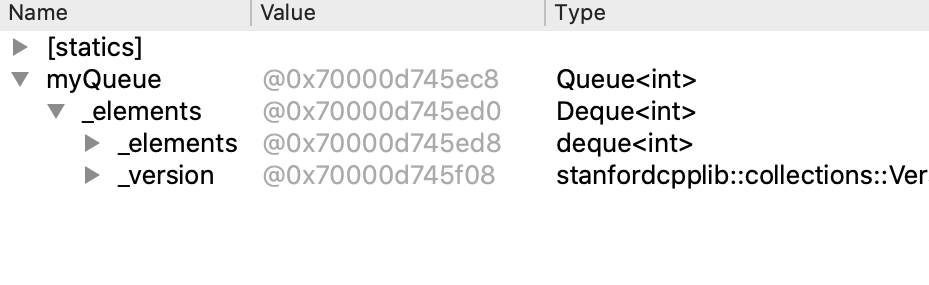
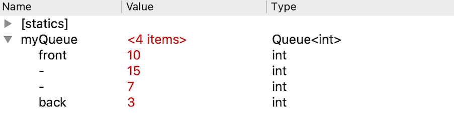
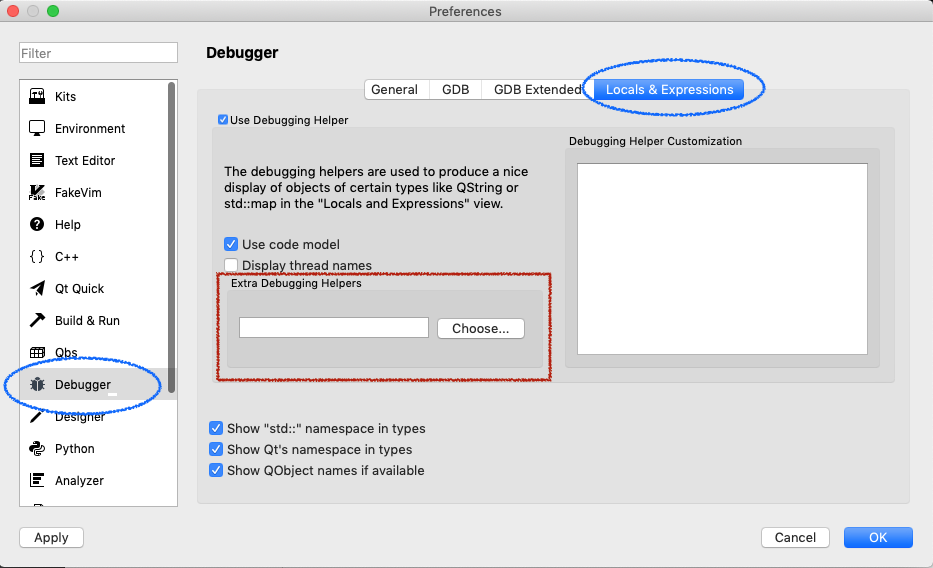

### Viewing Stanford collections in the debugger

***

When debugging a program that uses variables of Stanford collection type (Vector, Map, Queue, …), it is very helpful to be able to examine the contents of the collection in the debugger. To enable you to view inside a collection, we use a custom debugging helper written by one of our awesome section leaders Jeremy Barenholtz. Thanks, Jeremy!

- **Automatic install within the CS106 package**

  The custom debugging helper is included in our [package of CS106 specific components](./Install Qt Creator on Windows.md) that you previously installed. When installing the CS106 package, it copies the debugging helper into the appropriate place so that Qt Creator will automatically use it. In most cases, this effort is successful, but if it didn't take, we have instructions below on how you can manually configure it. You may also need to manually configure the helper if an update to Qt Creator wipes out your previous configuration.

- **Check if debugger helpers is configured**

  To determine if your Qt Creator is configured for the custom debugging helper, run any program under the debugger that uses a variable of a Stanford collection type and look at how the collection is displayed in the debugger variable pane. If the helper is configured, the collection contents will display in a readable, labeled layout. Without the helper, the collection innards are displayed in their raw form.

  For example, if your program declares `myQueue` as:

  ```c++
  Queue<int> myQueue = { 10, 15, 7, 3 }
  ```

  Viewing `myQueue` without the helper configured shows the **raw display**:

  

  With the helper, you get the **pretty display** (including size of queue, values for queue elements, and labels for the front and back elements):

  

  **what to do**

  - If you see the **pretty display**, your Qt Creator is already configured to use the debugging helper and you do not need to take further action. You are good to go!
  - If you see the **raw display**, follow the instructions in the next section to manually configure the helper.

- **To manually configure the debugging helper when you are not getting the pretty display**

  - Download this file: [stanfordtypes.py](./stanfordtypes.py) and store it somewhere on your computer where you will be able to easily find it later.
  
  - Open Qt Creator. If you have any projects already open in Qt Creator, close them now.
  
  - From the top menu, select **Qt Creator > Preferences** if you're on Mac, or **Edit > Preferences** if you're on Windows.
  
  - Select **Debugger** from the list of options on left side and **Locals and Expressions** from the top tab bar. Find the section labeled **Extra Debugging Helpers**. In the screenshot below, we use a red rectangle to frame the section you're looking for.
  
    
  
  - Click the **Choose** button to bring up a file browser. In the file browser, find and select the `stanfordtypes.py` file that you downloaded in Step 1.
  
  - Click the **Ok** button in the bottom-right corner to apply these changes. You should be good to go!
  
  If you re-run the check from above (to view a Stanford collection in debugger), you should now see the pretty display. If it didn't seem to take, re-do steps 4 and 5 and be sure you have selected the correct file. If you still can't get it to work, post on Ed or come to Lair so we can help you out.

