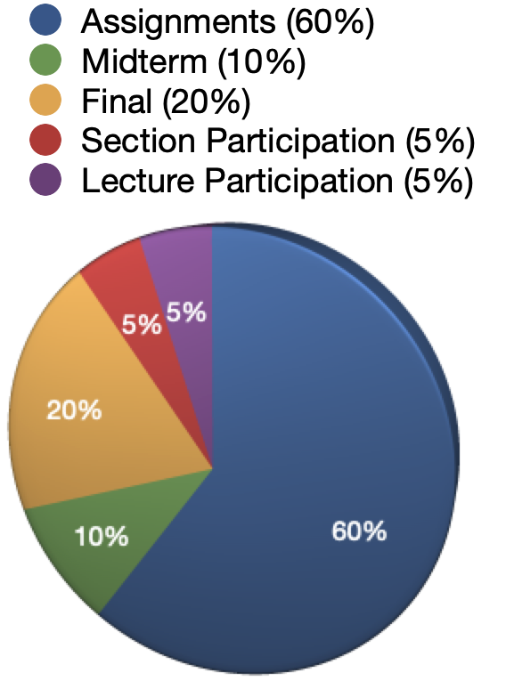
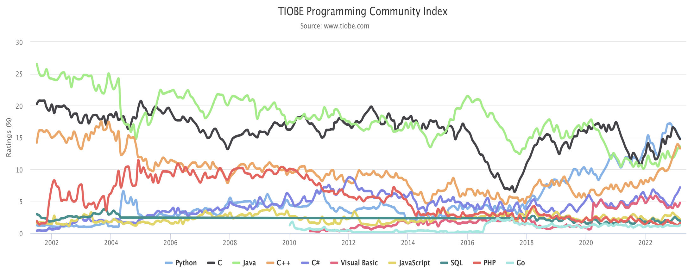
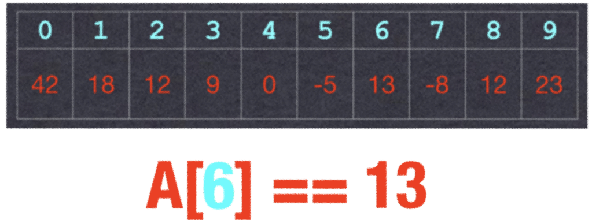

***

### **Lecture 1: Welcome!**

CS 106B: Programming Abstractions

Spring 2023, Stanford University Computer Science Department

Lecturer: Chris Gregg, Head CA: Neel Kishnani


***

Slide 2

### Today's Topics

> *What day is it?* asked Pooh.
>
> *It’s today*, squeaked Piglet.
>
> *My favorite day*, said Pooh.
>
> *― A.A. Milne*

- Lecture sign-in
- Instructor Introductions
- What is CS 106B?
  - Goals for the Course
  - Components of CS 106B
  - Assignments, Grading, Due dates, Late days, Sections, Getting Help
- C++
  - Why C++?
  - Qt Creator
  - Our first program
  - Our second program
  - The importance of Data Structures
- Assignment 0

***

Slide 3

### Lecture Sign-in

- We are trying a new sign-in method for lecture attendance (more later). Please connect to the Stanford WiFi in Hewlett and go to this link:

  https://web.stanford.edu/class/cs106b/cgi-bin/lecture/

- If you are in lecture and get the message, "You have not been checked in!", then sign in manually at the front of class after lecture.

***

Slide 4

### Instruction Team: Lecturer and Head CA

> Tell me and I forget, teach me and I may remember, involve me and I learn.
> *– Benjamin Franklin*

**Lecturer**

[Chris Gregg](./image/Chris.jpg)

**Head CA**

[Neel Kishnani](./image/Neel.jpeg)

***

Slide 5

### Instruction Team: Section Leaders

> When you learn, teach, when you get, give.
> *― Maya Angelou*


- There will be tons of Section Leaders, who will each lead a small online section, and will grade your work.
- They will also hold individual grading sessions (IGs), and they will staff the virtual LaIR for office hours.
- SLs are a tremendously dedicated group, and are outstanding teachers in their own right.

***

Slide 6

### What is CS 106B?

> Computer Science is no more about computers than astronomy is about telescopes.
> *― Edsger Dijkstra*

**CS106B: Learn core ideas in how to model and solve complex problems with computers**

[Complex Problem #1: Self Driving Cars](https://news.stanford.edu/2019/12/20/autonomous-delorean-drives-sideways-move-forward/)


***

Slide 7

### What is CS 106B?

> The most important property of a program is whether it accomplishes the intention of its user.
> *― C.A.R. Hoare*

**CS106B: Learn core ideas in how to model and solve complex problems with computers**

[Complex Problem #2: Compressing Data](https://web.stanford.edu/~cgregg/cgi-bin/video-calculator/)


- Comcast says that I should get "Upload speeds up to 15 Megabits per second (Mbps)". If I did (I usually don't), it would be impossible to send uncompressed video through Zoom.
- Luckily, the H.264 video standard that streaming services like Zoom often use have an incredible **2000:1** compression ratio, meaning that we can accomplish it.
- At the end of the course, we will investigate (and you will program!) an encoding algorithm that produces lossless compression (Zoom is lossy compression, meaning that some data is lost, but hopefully not enough to compromise the viewability of the stream).

***

Slide 8

### What is CS 106B?

> Speech recognition and the understanding of language is core to the future of search and information, but there are lots of hard problems such as understanding how a reference works, understanding what ‘he’, ‘she’ or ‘it’ refers to in a sentence. … That’s just one of the millions of problems to solve in language.
> *― Ben Gomes, Head of Search at Google*

**CS106B: Learn core ideas in how to model and solve complex problems with computers**

**Complex Problem #3: Speech Recognition**


- The fact that you can ask your phone, in your own language and with your own accent, a question and have it answer within seconds is incredible.
- The technology that allows this is not only complex, but it takes a tremendous amount of processing – your voice is analyzed in the cloud, not on your phone.

***

Slide 9

### CS 106B Goals

> A goal without a plan is just a wish.
> *– Antoine de Saint-Exupéry*

I think goals should never be easy, they should force you to work, even if they are uncomfortable at the time.
*–Michael Phelps*

**One of CS 106B's goals: Learn core ideas in how to model and solve complex problems with computers**

- To that end, we want to:
  - **Explore common abstractions**
  - Harness the power of recursion
  - Learn and analyze efficient algorithms

***

Slide 10

### Explore Common Abstractions

> Abstraction is one of the greatest visionary tools ever invented by human beings to imagine, decipher, and depict the world.
> *― Jerry Saltz*

The first programming assignment I had in high school was to find the first 100 Fibonacci numbers. Instead, I thought it would be cooler to write a program to get the teacher's password and all the other students' passwords. And the teacher gave me an A and told the class how smart I was.
*―Kevin Mitnick*

**How are user passwords kept secure when logging into a website (or, why shouldn't a website ever be able to send you your password?)**


***

Slide 11

### Explore Common Abstractions

> The radio doesn't want to play you until you're No.1 on Shazam, and you can't get No.1 on Shazam without getting played.
> *―Tones and I*

**How does [Shazam](https://www.shazam.com/) figure out what song is playing by listening through your microphone?**


***

Slide 12

### Explore Common Abstractions

> I'm so fast that last night I turned off the light switch in my hotel room and was in bed before the room was dark.
> *―Muhammad Ali*

[How can it be possible to search for a value in a data structure *without having to look at any* of the other values (or at least only a few other values)? I.e., how can we program *super fast search*?](https://yourbasic.org/algorithms/hash-tables-explained/)


***

Slide 13

### Explore Common Abstractions

> The best book on programming for the layman is 'Alice in Wonderland'; but that's because it's the best book on anything for the layman.
> *―Alan Perlis*

[What is a *digital signature*, and how can it be used to prove that I was the person that sent an email, or signed a document?](https://en.wikipedia.org/wiki/Digital_signature)


***

Slide 14

### **Common Abstractions**

> The effective exploitation of his powers of abstraction must be regarded as one of the most vital activities of a competent programmer.
> *–Edsger Dijkstra*

- How are user passwords kept secure when logging into a website (or, why shouldn't a website ever be able to send you your password?)
- How does Shazam figure out what song is playing by listening through your microphone?
- How can it be possible to search for a value in a data structure without having to look at any of the other values (or at least only a few other values)? I.e., how can we program super fast search?
- What is a digital signature, and how can it be used to prove that I was the person that sent an email, or signed a document?
- It turns out that all of these are solved with the same abstraction! They all use *hashing*, which we will talk about near the end of the course.
- By learning common abstractions, we can use those abstractions to solve many problems. See the course website to see the list of topics we will cover.

***

Slide 15

### **CS 106B Goals**

**CS106B: Learn core ideas in how to model and solve complex problems with computers**

> In order to understand recursion you must first understand recursion.
> *― Unknown*

- To that end, we want to:
  - Explore common abstractions
  - **Harness the power of recursion**
  - Learn and analyze efficient algorithms

***

Slide 16

### **Harness the power of recursion**

> When students first encounter recursion, they often react with suspicion to the entire idea, as if they have just been exposed to some conjurer's trick rather than a critically important programming methodology.
> *― Eric Roberts*

- The logic behind the recursive tree below takes about five lines of code:

  

***

Slide 17

### **Harness the power of recursion**

> Learning to think in this new way requires students to examine recursion from several different perspectives.
> *–Eric Roberts*

- Recursion is a powerful tool that we will learn — once you start thinking recursively, you will be able to solve many problems that would be extremely hard to solve without it.

  

***

Slide 18

### **CS 106B Goals**

**CS106B: Learn core ideas in how to model and solve complex problems with computers**

> I took a computer-science course to fill a prerequisite at Stanford, and I realized that every day was a new problem, and every day you got to think about how to solve something new, how to reason through something new, how to develop an algorithm to solve for something you hadn't worked on before.
> *―Marissa Mayer*

- To that end, we want to:
  - Explore common abstractions
  - Harness the power of recursion
  - **Learn and analyze efficient algorithms**

***

Slide 19

### **CS 106B: Learn Efficient Algorithms**

> Efficiency is intelligent laziness.
> *– David Dunham*

- The following image is from a puzzle game that is part of a CS 106B assignment for this quarter:

  

- Tiles are *matched* by ensuring that object halves make a pair – so, for instance, a bottle top in red must be next to (or above / below) a bottle bottom in red, as in the second and last tile in the top row.

- A puzzle is solved when all tiles match

***

Slide 20

### **CS 106B: Learn Efficient Algorithms**

> I will be ruthless in cutting out waste, streamlining structures and improving efficiency.
> *– Theresa May*

- The following is the solved puzzle:

  

- Edge-matching games are surprisingly difficult to solve by hand.

- Each tile can be oriented four ways, and each tile can be in any of the nine board positions. This gives a total of `9! * 4^9` combinations, or roughly *95 billion* different positions.

- Knowing what you learned in CS 106A, you could probably write an algorithm that could enumerate all possible combinations, and test each one. If it took one microsecond to check each solution (pretty fast for a desktop computer!), it would take 95,000 seconds to solve the puzzle, or over 26 hours to completely solve the puzzle.

- But with the ideas you'll learn in CS 106B, you will be able to write an algorithm to find all correct solutions (and there are eight of them) in *a quarter of a second!*

***

Slide 21

### **CS 106B: Course Information**

> The Google algorithm was a significant development. I've had thank-you emails from people whose lives have been saved by information on a medical website or who have found the love of their life on a dating website. Tim Berners-Lee
> *– Tim Berners-Lee (inventor of the World Wide Web)*

- The class website is here: https://web.stanford.edu/class/cs106b/ It will have all announcements, general information, lecture slides, section handouts, and other resources.
- We will also be using the [*Ed Discussion*](https://edstem.org/us/courses/38497/discussion/) forum this quarter, where you can ask and answer questions about course material (with runnable test code), and also discuss other course-related information.

***

Slide 22

### **CS 106B: Course Components**

> Many jobs at Google require math, computing, and coding skills, so if your good grades truly reflect skills in those areas that you can apply, it would be an advantage. But Google has its eyes on much more.
> *– Thomas Friedman*



- We want students to attend lecture, so we are including a lecture participation component. When you come to lecture, sign in by going to the following link (you must be on Hewlett 200's WiFi, or you can sign in by hand at the end of class):

  https://web.stanford.edu/class/cs106b/cgi-bin/lecture/

- We also want section discussions to be robust, so we are including a section participation component. To get an "A" in the class, you may only miss **one** section.

- There will be a midterm on **Wednesday, May 3rd**, and the final exam is on **June 9th, 8:30am-11:30am, PDT**.

- The assignments are the most important part of the course, and weighted accordingly.

- **Important: If you are an undergraduate, you must take the course for 5 units. We will not assign grades to undergraduates who take the course for fewer than 5 units.**

***

Slide 23

### **CS 106B: Assignments in CS 106B**

> When I've least expected it, an enormous opportunity or stroke of luck has crossed right under my nose. So I tell everybody, if you're passionate about what you do and you love it, do it. But do your homework. Because you'll never know when the opportunity is going to happen.
> *– Julie Andrews*

- Due Fridays (Assignments 0-4) or Wednesdays (Assignments 5-7), [Midnight PDT](https://www.timeanddate.com/worldclock/usa/palo-alto)
- If you hand the assignment in on time, there will be a small bonus applied to your grade. If you hand it in by Saturday, Midnight, PDT, you don't get the bonus. Assignments won't be accepted after Saturday (Thursday for assignments 5-7).
- *Please note:* The grace period is an *automatic extension* – asking for further extensions past the grace period will normall be disapproved, unless there are special circumstances.
- Extensions approved by Chris or Neel.
- Graded by your section leader.
- Interactive, one-on-one grading session.
- Graded on Style and Functionality. We will give you many exposed functionality tests, but we won't necessarily give you all of them for all assignments.

***

Slide 24

### **CS 106B: Grading Style**

> Style is the substance of the subject called unceasingly to the surface.
> *– Victor Hugo*

**Grade**   **Description**

**+**            Exceeds requirements.

**✓+**         Satisfies all requirements of the assignment.

**✓**           Meets most requirements, but with some problems.

**✓-**          Has more serious problems.

**-**             Better than nothing.

***

Slide 25

### **CS 106B: Sections**

> Poetry comes alive to me through recitation.
> *– Natalie Merchant*


- Weekly 1hr sections led by awesome section leaders (the backbone of the class!)
- For an "A" in the class, you may only miss one section
- Signups begin Thursday at 5:00pm PDT
- Signups close Sunday at 5:00pm PDT

***

Slide 26

### **You need to ask questions if you are confused**

> The best scientists and explorers have the attributes of kids! They ask question and have a sense of wonder. They have curiosity. 'Who, what, where, why, when, and how!' They never stop asking questions, and I never stop asking questions, just like a five year old.
> *– Sylvia Earle*

- Please make judicious use of [Ed Discussion](https://edstem.org/us/courses/38497/discussion/), Section, and Office Hours!

***

Slide 27

### **Getting Help**

> I am going to change the world, and I'm talking to everybody in the possible world that I can get to that can help me to do that.
> *– Abby Wambach*

- Steps to get help in CS 106B:
  - Ed Discussion
  - Sign in to the LaIR / Instructor Office Hours
  - Contact your Section Leader
  - Email Chris or Neel

***

Slide 28

### **CS106L**

- If you are looking to go deeper into learning about the C++ language (which is very powerful), CS106L is a cool 1U, C/NC class with three fun projects that go into details not covered in 106B.
- If you want to strengthen your programming skills with the intent of doing coding interviews, 106L is a good class to take
- If you love coding and want some more projects to work on, try CS106L
- To find out more, visit [https://cs106l.stanford.edu](https://cs106l.stanford.edu/).

***

Slide 29

### **One Last Detail…**

> Writing in C or C++ is like running a chain saw with all the safety guards removed.
> *– Bob Gray*

> Within C++, there is a much smaller and cleaner language struggling to get out.
> *– Bjarne Stroustrup (the creator of C++)*

> C++: an octopus made by nailing extra legs onto a dog.
> *– Steve Taylor*

***

Slide 30

### **C++**

>Writing in C or C++ is like running a chain saw with all the safety guards removed.
>*– Bob Gray*



- Although there are hundreds of computer languages, in CS 106B we will be using the C++ language, which is not the easiest language to learn, but it is powerful and popular (and will help you get an internship!)

- What is the most used language in programming? (select to show) Profanity!

***

Slide 31

### **CS 106/107 languages**

>If someone claims to have the perfect programming language, he is either a fool or a salesman or both.
>*– Bjarne Stroustrup*


| Class   |      | Language |      | Year Created |
| ------- | ---- | -------- | ---- | ------------ |
| CS 106A |      | Python   |      | 1990         |
| CS 106B |      | C++      |      | 1983         |
| CS 107  |      | C        |      | 1972!        |

- C++ has its syntax based on C (Python is a bit different)
- The languages are different enough that each does take time to learn.

***

Slide 32

### **Your First C++ Program!**

>And programming computers was so fascinating. You create your own little universe, and then it does what you tell it to do.
>*– Vint Cerf (the "father of the internet")*

- As you'll find out, learning a new language when you already know a language is not really that hard, especially for "imperative" languages like Java, C++, and C (and Javascript, Python, and Ruby, etc.)
- Non-imperative languages —"functional" languages — (LISP, Haskell, ML, etc.) take a completely different mentality to learn, and you'll get to those in later CS classes, like Programming Languages.
- Let's write our "Hello, World!" program in C++.


***

Slide 33

### **Your First C++ Program!**

>There are two ways to write error-free programs; only the third one works.
>*– Alan Perlis*

- Steps:
  - Install Qt Creator (see [install QT instructions](../Qt/Resources_for_Qt_Creator.md))
  - Download the [Sample project](./SampleProject.zip)
  - Open the `Sample.pro` project file in Qt Creator
  - In Qt Creator, "Configure Project" for your system
  - Select `Sources->main.cpp` in the browser
  - Now we're ready to code…

***

Slide 34

### **Your First C++ Program!**

>When someone says: "I want a programming language in which I need only say what I wish done", give him a lollipop.
>*– Alan Perlis*

```c++
// Our first C++ program!

// headers:
#include <iostream>
#include "console.h" // Stanford library
using namespace std;

// main
int main()
{
    cout << "Hello, World!" << endl;
    return 0;
}
```

output

```c++
Hello, World!
```

- To compile: Select `Build->Build Project "hello-world"` (or ⌘-B or Alt-B)
- To run in "Debug" mode: Select `Debug->Start Debugging->Start Debugging` (or ⌘-Y or Alt-Y)
- You should see a console window pop up that says, "Hello, World!"

***

Slide 35

### **Your *Second* C++ Program!**

>If people built houses the way we write programs, the first woodpecker would wipe out civilization.
>*– Dennis Hall*

- Let's write a more advanced program, one that creates a `vector` (which is similar to a `list` in Python), and populates the vector with 100,000 even integers from 0 to 198,998.
- You'll see that this looks somewhat different than the equivalent program in Python – ther are a number of differences in C++.
- For time reasons, we'll just write it in the same `hello-world.cpp` file.



***

Slide 36

### **Your *Second* C++ Program!**

>Software and cathedrals are much the same – first we build them, then we pray.
>*– Sam Redwine*

```c++
// Populate a Vector

// headers:
#include <iostream>
#include "console.h" // Stanford library
#include "vector.h" // Stanford library

using namespace std;

const int NUM_ELEMENTS = 100000;

// main
int main()
{
    Vector<int> myList;
    cout << "Populating a Vector with even integers less than "
         << (NUM_ELEMENTS * 2) << endl;

    for (int i=0; i < NUM_ELEMENTS; i++){
        myList.add(i*2);
    }

    for (int i : myList) {
        cout << i << endl;
    }
    return 0;
}
```

***

Slide 37

### **The Importance of Data Structures**

>Beware of bugs in the above code; I have only proved it correct, not tried it.
>*– Donald Knuth*

- One reason we care about data structures is, quite simply, time. Let’s say we have a program that does the following (and times the results):
  - Creates four “list-like” containers for data.
  - Adds 100,000 elements to each container – specifically, the even integers between 0 and 198,998 (sound familiar?).
  - Searches for 100,000 elements (all integers 0-100,000)
  - Attempts to delete 100,000 elements (integers from 0-100,000)
- What are the results?

***

Slide 38

### **The Importance of Data Structures**

>Computer Science is embarrassed by the computer.
>*– Alan Perlis*

- Results:

- Processor: Apple M1, 3.2GHz (Macbook Air), Compiler: clang++

- Compile options:

  ```c++
  clang++ -Os -std=c++11 -Wall -Wextra ContainerTest.cpp -o ContainerTest
  ```

```c++
Structure         Overall(s)
Unsorted Vector:  1.77514
Linked List:      6.53712
Binary Tree:      0.01465
Hash Table:       0.00400
Sorted Vector:    0.26143
```

- Difference between unsorted vector and hash table: 444x
- Difference between linked list and hash table: 1600x!
- Note: In general, for this test, we used optimized library data structures (from the "standard template library") where appropriate. The Stanford libraries are not optimized.
- Overall, the Hash Table "won" — but (as we shall see!) while this is generally a great data structure, there are trade-offs to using it.

***

Slide 39

### **The Importance of Data Structures**

>On two occasions I have been asked, – "Pray, Mr. Babbage, if you put into the machine wrong figures, will the right answers come out?" In one case a member of the Upper, and in the other a member of the Lower House put this question. I am not able rightly to apprehend the kind of confusion of ideas that could provoke such a question.
>*– Charles Babbage*

```
Structure         Overall(s)    Insert(s)     Search(s)     Delete(s)
Unsorted Vector:  1.77514       0.00031       1.23618       0.53866
Linked List:      6.53712       0.00179       4.67681       1.85852
Binary Tree:      0.01465       0.01266       0.00133       0.00066
Hash Table:       0.00400       0.00318       0.00035       0.00047
Sorted Vector:    0.26143       0.18440       0.00135       0.07567
```

- Why are there such discrepancies??
  - Some structures carry more information simply because of their design.
  - Manipulating structures takes time

***

Slide 40

### **HW 0**

>If you lie to the computer, it will get you.
>*– Perry Farrar*

- HW 0 is a "get to know the tools" assignment.
  - Here is the [Assignment 0 writeup](./Assignment0_Welcome_to_CS106B!.md).
  - [Installing Qt Creator](../Qt/Resources_for_Qt_Creator.md) will take the most time (multiple hours, in some cases).
  - The rest of the assignment should not take more than half an hour to complete, and it includes configuring Qt Creator, running an example program, learning about the debugger, and filling out a form.

Thursday night there will be a special LaIR to help install tools if necessary.

Due: Friday, April 7th, at Noon PDT

