***

### **Lecture 1: Welcome!**

CS 106B: Programming Abstractions

Spring 2023, Stanford University Computer Science Department

Lecturer: Chris Gregg, Head CA: Neel Kishnani

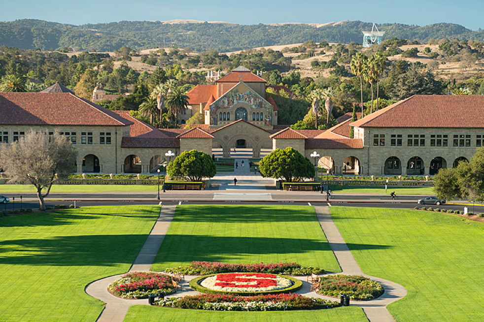

***

Slide 2

### Today's Topics

*What day is it?* asked Pooh.

*It’s today*, squeaked Piglet.

*My favorite day*, said Pooh.

*― A.A. Milne*

- Lecture sign-in
- Instructor Introductions
- What is CS 106B?
  - Goals for the Course
  - Components of CS 106B
  - Assignments, Grading, Due dates, Late days, Sections, Getting Help
- C++
  - Why C++?
  - Qt Creator
  - Our first program
  - Our second program
  - The importance of Data Structures
- Assignment 0

***

Slide 3

### Lecture Sign-in

- We are trying a new sign-in method for lecture attendance (more later). Please connect to the Stanford WiFi in Hewlett and go to this link:

  https://web.stanford.edu/class/cs106b/cgi-bin/lecture/

- If you are in lecture and get the message, "You have not been checked in!", then sign in manually at the front of class after lecture.

***

Slide 4

### Instruction Team: Lecturer and Head CA

Tell me and I forget, teach me and I may remember, involve me and I learn.
*– Benjamin Franklin*

**Lecturer**

[Chris Gregg](./image/Chris.jpg)

**Head CA**

[Neel Kishnani](./image/Neel.jpeg)

***

Slide 5

### Instruction Team: Section Leaders

When you learn, teach, when you get, give.
*― Maya Angelou*

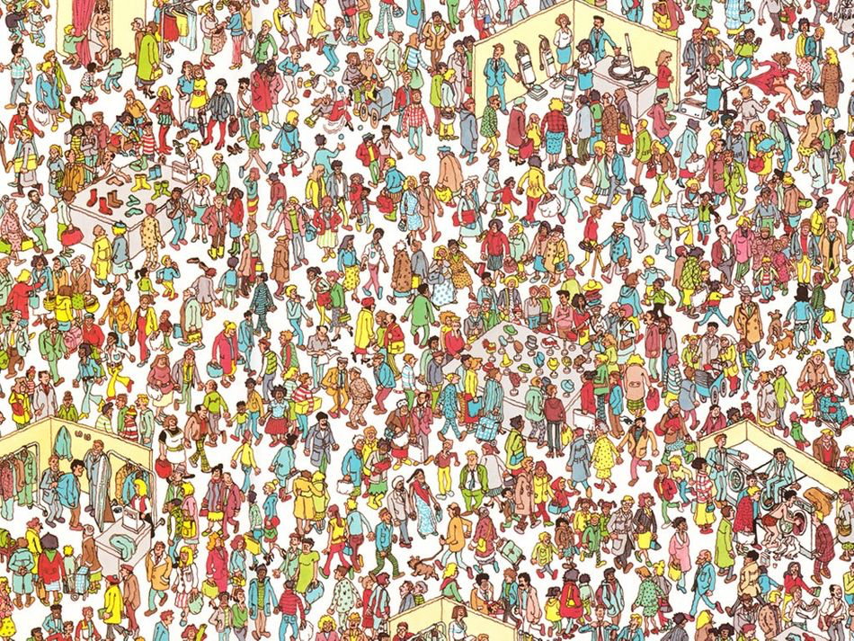

- There will be tons of Section Leaders, who will each lead a small online section, and will grade your work.
- They will also hold individual grading sessions (IGs), and they will staff the virtual LaIR for office hours.
- SLs are a tremendously dedicated group, and are outstanding teachers in their own right.

***

Slide 6

### What is CS 106B?

Computer Science is no more about computers than astronomy is about telescopes.
*― Edsger Dijkstra*

**CS106B: Learn core ideas in how to model and solve complex problems with computers**

[Complex Problem #1: Self Driving Cars](https://news.stanford.edu/2019/12/20/autonomous-delorean-drives-sideways-move-forward/)

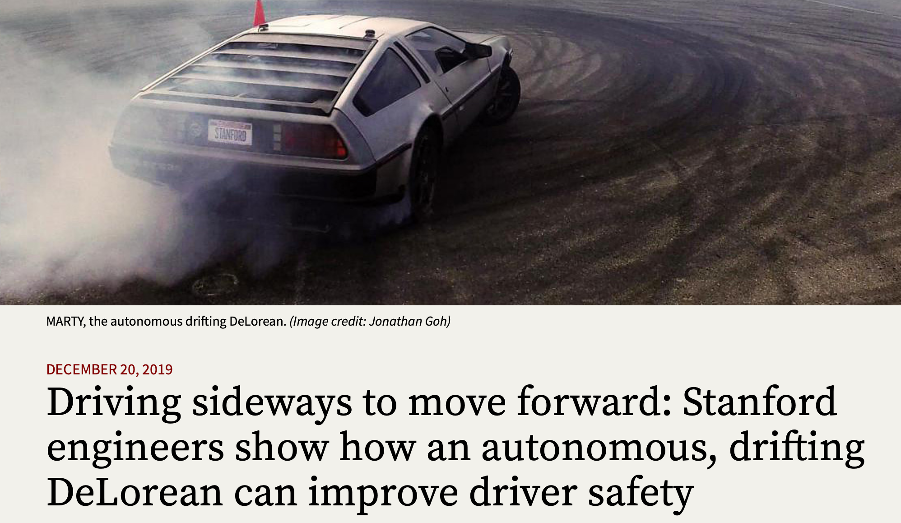

***

Slide 7

### What is CS 106B?

The most important property of a program is whether it accomplishes the intention of its user.
*― C.A.R. Hoare*

**CS106B: Learn core ideas in how to model and solve complex problems with computers**

[Complex Problem #2: Compressing Data](https://web.stanford.edu/~cgregg/cgi-bin/video-calculator/)

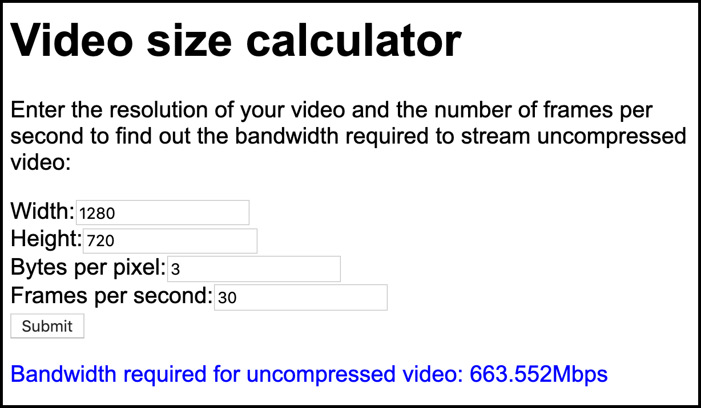

- Comcast says that I should get "Upload speeds up to 15 Megabits per second (Mbps)". If I did (I usually don't), it would be impossible to send uncompressed video through Zoom.
- Luckily, the H.264 video standard that streaming services like Zoom often use have an incredible **2000:1** compression ratio, meaning that we can accomplish it.
- At the end of the course, we will investigate (and you will program!) an encoding algorithm that produces lossless compression (Zoom is lossy compression, meaning that some data is lost, but hopefully not enough to compromise the viewability of the stream).

***

Slide 8

### What is CS 106B?

Speech recognition and the understanding of language is core to the future of search and information, but there are lots of hard problems such as understanding how a reference works, understanding what ‘he’, ‘she’ or ‘it’ refers to in a sentence. … That’s just one of the millions of problems to solve in language.
*― Ben Gomes, Head of Search at Google*

**CS106B: Learn core ideas in how to model and solve complex problems with computers**

**Complex Problem #3: Speech Recognition**

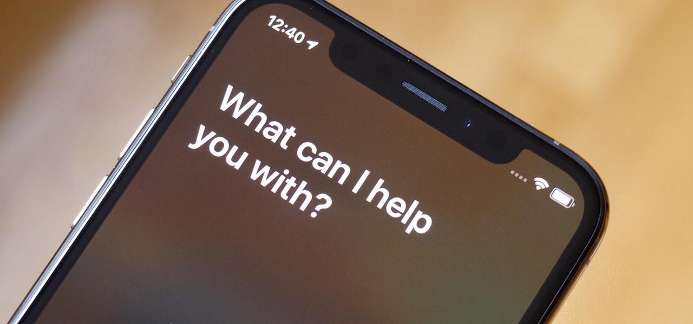

- The fact that you can ask your phone, in your own language and with your own accent, a question and have it answer within seconds is incredible.
- The technology that allows this is not only complex, but it takes a tremendous amount of processing – your voice is analyzed in the cloud, not on your phone.

***

Slide 9

### CS 106B Goals

A goal without a plan is just a wish.
*– Antoine de Saint-Exupéry*

I think goals should never be easy, they should force you to work, even if they are uncomfortable at the time.
*–Michael Phelps*

**One of CS 106B's goals: Learn core ideas in how to model and solve complex problems with computers**

- To that end, we want to:
  - **Explore common abstractions**
  - Harness the power of recursion
  - Learn and analyze efficient algorithms

***

Slide 10

### Explore Common Abstractions

Abstraction is one of the greatest visionary tools ever invented by human beings to imagine, decipher, and depict the world.
*― Jerry Saltz*

The first programming assignment I had in high school was to find the first 100 Fibonacci numbers. Instead, I thought it would be cooler to write a program to get the teacher's password and all the other students' passwords. And the teacher gave me an A and told the class how smart I was.
*―Kevin Mitnick*

**How are user passwords kept secure when logging into a website (or, why shouldn't a website ever be able to send you your password?)**

***

Slide 11

### Explore Common Abstractions

The radio doesn't want to play you until you're No.1 on Shazam, and you can't get No.1 on Shazam without getting played.
*―Tones and I*

**How does [Shazam](https://www.shazam.com/) figure out what song is playing by listening through your microphone?**

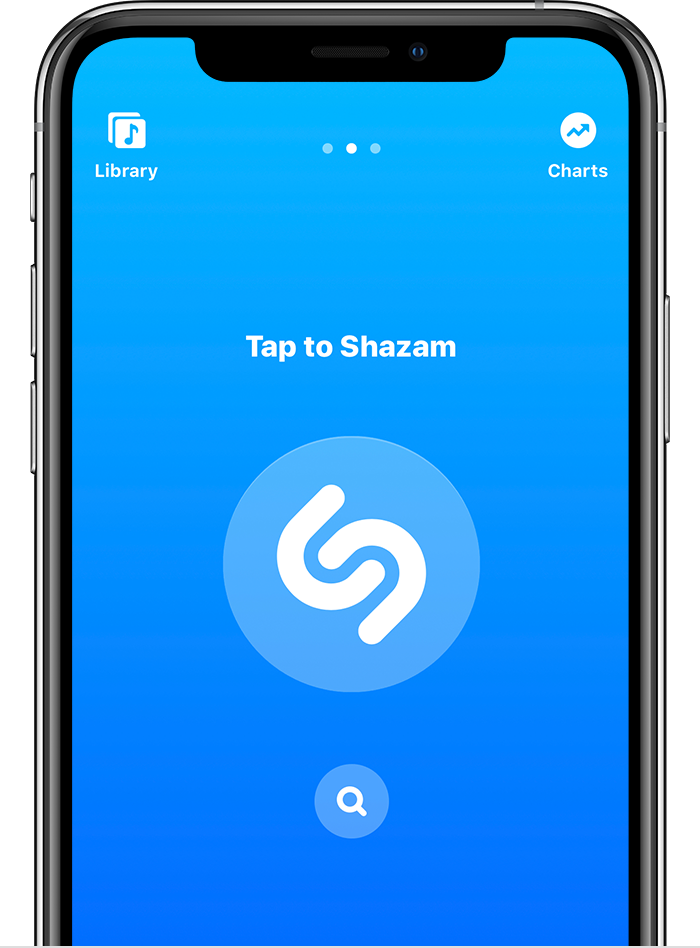

***

Slide 12

### Explore Common Abstractions

I'm so fast that last night I turned off the light switch in my hotel room and was in bed before the room was dark.
*―Muhammad Ali*

[How can it be possible to search for a value in a data structure *without having to look at any* of the other values (or at least only a few other values)? I.e., how can we program *super fast search*?](https://yourbasic.org/algorithms/hash-tables-explained/)

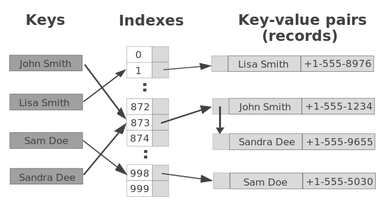

***

Slide 13

### Explore Common Abstractions

The best book on programming for the layman is 'Alice in Wonderland'; but that's because it's the best book on anything for the layman.
*―Alan Perlis*

[What is a *digital signature*, and how can it be used to prove that I was the person that sent an email, or signed a document?](https://en.wikipedia.org/wiki/Digital_signature)

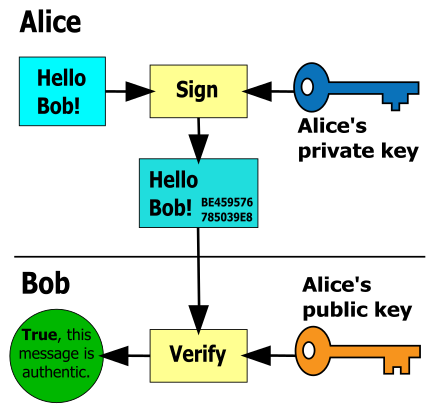

***

Slide 14

### **Common Abstractions**

The effective exploitation of his powers of abstraction must be regarded as one of the most vital activities of a competent programmer.
*–Edsger Dijkstra*

- How are user passwords kept secure when logging into a website (or, why shouldn't a website ever be able to send you your password?)
- How does Shazam figure out what song is playing by listening through your microphone?
- How can it be possible to search for a value in a data structure without having to look at any of the other values (or at least only a few other values)? I.e., how can we program super fast search?
- What is a digital signature, and how can it be used to prove that I was the person that sent an email, or signed a document?
- It turns out that all of these are solved with the same abstraction! They all use *hashing*, which we will talk about near the end of the course.
- By learning common abstractions, we can use those abstractions to solve many problems. See the course website to see the list of topics we will cover.

***

Slide 15

### **CS 106B Goals**

**CS106B: Learn core ideas in how to model and solve complex problems with computers**

In order to understand recursion you must first understand recursion.
*― Unknown*

- To that end, we want to:
  - Explore common abstractions
  - **Harness the power of recursion**
  - Learn and analyze efficient algorithms

***

Slide 16

### **Harness the power of recursion**

When students first encounter recursion, they often react with suspicion to the entire idea, as if they have just been exposed to some conjurer's trick rather than a critically important programming methodology.
*― Eric Roberts*

- The logic behind the recursive tree below takes about five lines of code:

  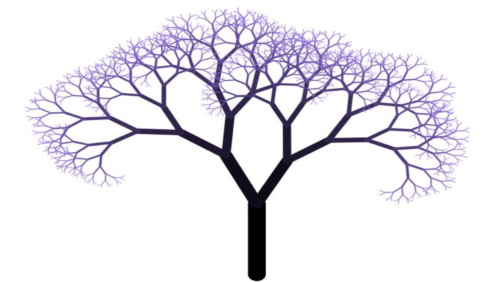

***

Slide 17

### **Harness the power of recursion**

Learning to think in this new way requires students to examine recursion from several different perspectives.
*–Eric Roberts*

- Recursion is a powerful tool that we will learn — once you start thinking recursively, you will be able to solve many problems that would be extremely hard to solve without it.

  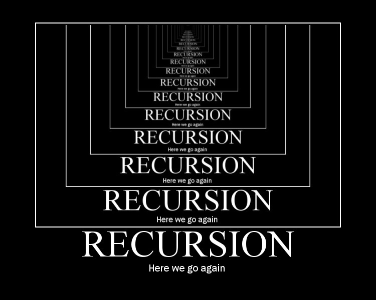

***

Slide 18

### **CS 106B Goals**

**CS106B: Learn core ideas in how to model and solve complex problems with computers**

I took a computer-science course to fill a prerequisite at Stanford, and I realized that every day was a new problem, and every day you got to think about how to solve something new, how to reason through something new, how to develop an algorithm to solve for something you hadn't worked on before.
*―Marissa Mayer*

- To that end, we want to:
  - Explore common abstractions
  - Harness the power of recursion
  - **Learn and analyze efficient algorithms**

***

Slide 19

### **CS 106B: Learn Efficient Algorithms**

Efficiency is intelligent laziness.
*– David Dunham*

- The following image is from a puzzle game that is part of a CS 106B assignment for this quarter:

  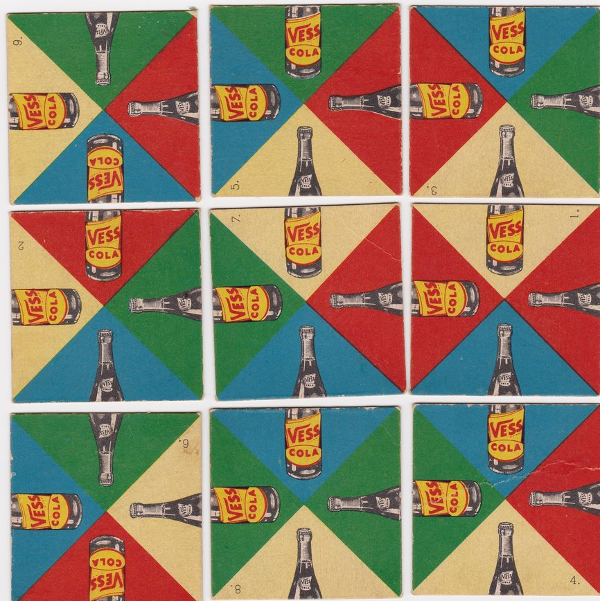

- Tiles are *matched* by ensuring that object halves make a pair – so, for instance, a bottle top in red must be next to (or above / below) a bottle bottom in red, as in the second and last tile in the top row.

- A puzzle is solved when all tiles match

***

Slide 20

### **CS 106B: Learn Efficient Algorithms**

I will be ruthless in cutting out waste, streamlining structures and improving efficiency.
*– Theresa May*

- The following is the solved puzzle:

  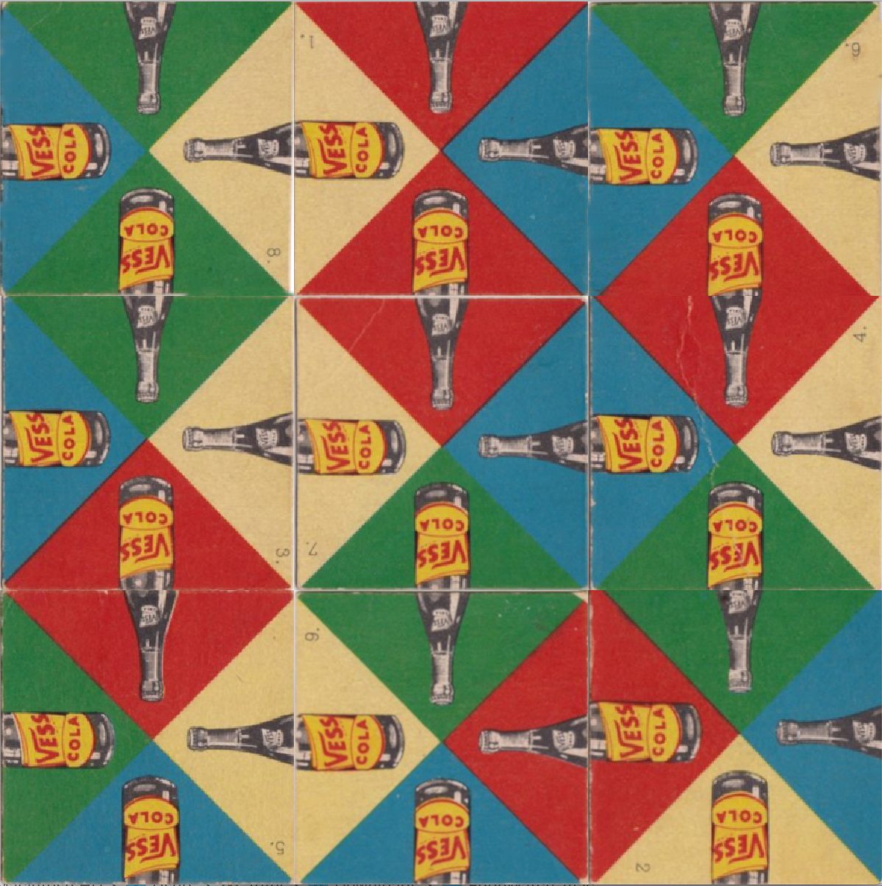

- Edge-matching games are surprisingly difficult to solve by hand.

- Each tile can be oriented four ways, and each tile can be in any of the nine board positions. This gives a total of `9! * 4^9` combinations, or roughly *95 billion* different positions.

- Knowing what you learned in CS 106A, you could probably write an algorithm that could enumerate all possible combinations, and test each one. If it took one microsecond to check each solution (pretty fast for a desktop computer!), it would take 95,000 seconds to solve the puzzle, or over 26 hours to completely solve the puzzle.

- But with the ideas you'll learn in CS 106B, you will be able to write an algorithm to find all correct solutions (and there are eight of them) in *a quarter of a second!*

***

Slide 21

### **CS 106B: Course Information**

The Google algorithm was a significant development. I've had thank-you emails from people whose lives have been saved by information on a medical website or who have found the love of their life on a dating website. Tim Berners-Lee
*– Tim Berners-Lee (inventor of the World Wide Web)*

- The class website is here: https://web.stanford.edu/class/cs106b/ It will have all announcements, general information, lecture slides, section handouts, and other resources.
- We will also be using the [*Ed Discussion*](https://edstem.org/us/courses/38497/discussion/) forum this quarter, where you can ask and answer questions about course material (with runnable test code), and also discuss other course-related information.

***

