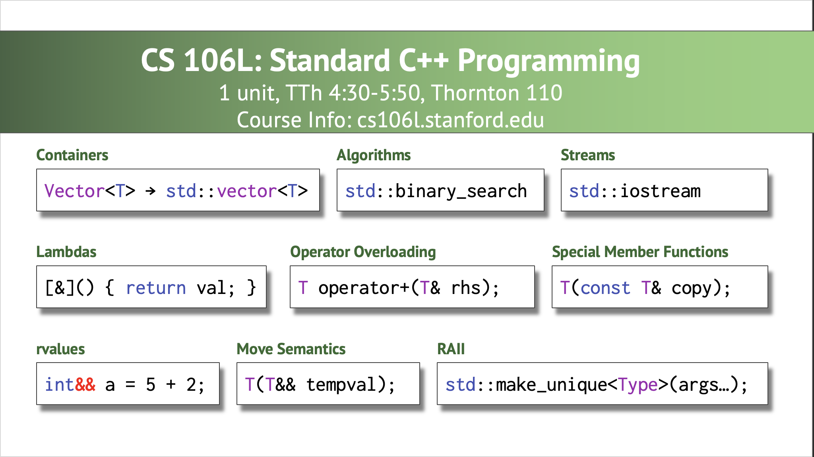

***

### **From Python to C++**

**CS 106B: Programming Abstractions**

**Spring 2023, Stanford University Computer Science Department**

**Lecturer: Chris Gregg, Head CA: Neel Kishnani**


***

### **Announcements**

- Qt Installation Session
  - **Tonight (Wednedsay) from 7-9pm, Huang Basement**
  - Get help with installing the software that you need to do assignments in this class.
  - Information on how to sign up and get help will be posted in an announcement on the course website tomorrow.
- Section Signups
  - Your assigned section leader will teach your weekly section, and also be responsible for grading all of your assignments and conducting your assessments.
  - Section signups will open tomorrow (Thursday 4/6) at 5pm PDT and close on Sunday (4/9) at 5pm PDT – **it is not first-come first-served but you must submit your preferences at some point during this time span!**
  - Fill out your section preferences on the [CS198 website](https://cs198.stanford.edu/cs198/auth/default.aspx).

***

Slide 2

### **A Tour Through C++**

- Topics for Today:
  - 106L
  - What are the core differences between Python and C++?
    - Comments
    - `#include` statements
    - typed variables
    - standard output (`cout`)
    - Blocks: curly braces
    - `while` loops
    - `for` loops
    - scoping
    - boolean expressions, boolean operators, and the `if` statement
    - functions
      - The `main` function
      - Passing by value and reference
    - header files
    - we will cover `Vectors` in the next lecture, and strings in the following lecture

***

Slide 3



Slide 4

### **Overview of C++**

- If you took CS 106A, taught in Python, this lecture is particularly suited to you. If you took AP CS in Java, much of this lecture will be familiar, but some parts will still be new.
- C++ is a high-performance, robust (and complex) language. It originally began (in 1985 ) as *C with Classes*. It has been an *Object Oriented* language from the beginning, and its inventor, [Bjarne Stroustrup](https://www.youtube.com/watch?v=9QKHg8wj4MA), chose to base the language on the "C" language because it was a fast, widely used language already.
- C++ is complex enough that it is very, very hard to completely master it. We will touch on only a small fraction of the language in this course, but if you want to learn more, there are plenty of tutorials and resources.
- Unlike Python, C++ does not come with a built-in library of data structures and functionality, and almost all of those features are provided through libraries.
  - In CS 106B, we rely primarily on the `iostream` and `string` libraries (part of the *Standard* library available with most C++ compilers), and also with the *Stanford* library, which includes many data structures, and helper functions.
  - If you go on to program in C++ in the future (e.g., in CS 110, or in an internship), you will need to learn other standard libraries, which sometimes mimic the Stanford library but with mostly minor differences and some major differences.
  - C++ is a *compiled* language, as opposed to Python, which is an *interpreted* language. This means that before running a C++ program, you must first compile it to machine code.

***

Slide 5

### **Comments**

**You might be used to the following types of comments in Python:**

Single-line comments:

```python
# Python:
# A hash comments out the rest of the line
myVar = 5 # everything past the hash is a comment
```

Multi-line comments:

```python
# Python:
""" This is a multiline
comment, and I end it with three quotes
"""
```

**C++ also has two types of comments:**

Single-line comments:

```c++
// C++:
// Two forward slashes comment out the rest of the line
int myVar = 5; // everything past the double-slash is a comment
```

Multi-line comments:

```c++
// C++:
/* This is a multiline
comment, and I end it with an asterisk-slash
*/
```

***

Slide 6

### **`#include` statements**

In Python, you `import` modules, and the equivalent in `C++` is a `#include` (*pound include)*. There are two different ways to use this statement:

`#include <iostream>` When using the angle brackets, `<` and `>`, this tells the compiler to include libraries that are in pre-defined locations based on the setup for your compiler or IDE (e.g., Qt Creator).

`#include "all-examples.h"` When using double quotes, this tells the compiler to first search in the same directory as the current file. In this case, the `.h` extension means *header* file, which we will discuss soon.

- `#include` directives literally tell the compiler to read in and paste code from another file at that particular point in your program.

***

Slide 7

### **Typed Variables**

- As you should know from prior programming classes, all variables have a *type* associated with them, where the type describes the representation of the variable. For example, a variable may be an integer, or a floating point number, or a string.

- In Python, variables have types, but the type is not explicitly written out when defining a variable. E.g.,

  ```python
  # Python:
  a = 5 # the Python interpreter knows this is an integer
  a = "aardvark" # now the variable is a string!
  ```

- In C++, *all types must be defined when the variable is created*, and *a variable cannot change its type*. For example:

  ```c++
  // C++:
  int a = 5; // a is an integer
  char b = 'x'; // b is a char ("character")
  float c = 1.42; // c is a floating point number
  double d = 1.4245593330222211176; // d is a double, a more accurate floating point number
  string s = "this is a C++ string";
  float a = 4.2; // ERROR! You cannot redefine a variable to be another type
  int a = 12; // ERROR! You do not need the type when re-assigning a variable
  a = 12; // this is okay
  ```

- By the way:

  - In C++, all statements must end with a semicolon `;`
  - Indentation is not enforced by the compiler, but Qt Creator should indent properly for you. If it doesn't, you should format the code yourself (Select All then right/ctrl-click and then choose "Auto-indent Selection").

***

Slide 8

### **Standard Output**

- Printing to the screen is the most common output in a program. Being able to output to the screen gives your user feedback, and also can be a great way to debug your programs.

- In Python, you have the `print` function:

  ```python
  # Python:
  num = 42
  theAnswer = "The answer to life, the universe, and everything"
  print(f"{theAnswer} is {num}.")
  ```

  Output:

  ```pyt
  The answer to life, the universe, and everything is 42.
  ```

- In C++, we have a function called `cout` ("console out") that prints, but we use it in a different way:

  ```c++
  // C++:
  int num = 42;
  string theAnswer = "The answer to life, the universe, and everything";
  cout << theAnswer << " is " << num << "." << endl;
  ```

  Output:

  ```c++
  The answer to life, the universe, and everything is 42.
  ```

- You can think of the double-angle brackets, `<<` as meaning "send to `cout`".

- The `endl` is necessary to put the cursor on a different line. Here is an example with and without the `endl`:

  ```c++
  // C++:
  cout << "This is some text followed by endl." << endl;
  cout << "This is more text.";
  cout << "We want to go to the next line here, too" << endl;
  cout << "We made it to the next line." << endl;
  ```

  Output:

  ```c++
  This is some text followed by endl.
  This is more text.We want to go to the next line here, too
  We made it to the next line.
  ```

***

Slide 9

### **Blocks: curly braces, `while` loops**

- In Python, a block is defined as an indentation level, where *whitespace* is important. C++ does not have many whitespace restrictions, so blocks are denoted with curly braces, `{` to begin a block, and `}` to end a block.

- Blocks are used primarily for functions (we will see this shortly), and also for loops.

- Let's first look at the `while` loop. Here is what you might be used to in Python:

  ```python
  # Python:
  i = 0
  while i < 5:
    print(i)
    i += 1
  ```

  Output:

  ```python
  0
  1
  2
  3
  4
  ```

- In C++, we also have a `while` loop, in the following form:

  ```c++
  while (expression) {
    statement;
    statement;
    ... 
  }
  ```

- As long as `expression` is `true`, the loop continues (we will discuss boolean expressions soon).

- The parentheses surrounding `expression` are required.

- Example:

  ```c++
  // C++:
  int i = 0;
  while (i < 5) {
    cout << i << endl;
    i++;
  }
  ```

  Output:

  ```c++
  0
  1
  2
  3
  4
  ```

- The `i++` increments the variable `i` by `1`, and is the reason C++ got its name! (and there is a corresponding decrement operator, `--`, as in `i--`).

***

Slide 10

### **`for` loops**

- If we know ahead of time how many times we want to run a loop, the `for` loop is often a better choice than a `while` loop. In Python, for loops are actually a bit more robust than in C++, and they have a different structure. Here is a typical Python `for` loop:

  ```python
  # Python:
  for i in range(3):
    print(i)
  ```

  Output:

  ```python
  0
  1
  2
  ```

- In C++, `for` loops have the following form, which may take a bit of getting used to:

  ```c++
  for (initializationStatement; testExpression; updateStatement) {
    statement;
    statement;
    ...
  } 
  ```

- The `initializationStatement` happens at the beginning of the loop, and initializes a variable. E.g., `int i = 0`.

- The `testExpression` is evaluated initially, and after each run through the loop, and if it is `true`, the loop continues for another iteration. E.g., `i < 3`.

- The `updateStatement` happens after each loop, but *before* `testExpression` is evaluated. E.g., `i++`.

- Here is the above example, written in C++:

  ```c++
  // C++
  for (int i = 0; i < 3; i++) {
    cout << i << endl;
  }
  ```

  Output:

  ```c++
  0
  1
  2
  ```

- Here is the equivalent way to write the above code as a `while` loop:

  ```c++
  // C++:
  int i = 0;
  while (i < 3) {
    cout << i << endl;
    i++;
  }
  ```

- There is another type of `for` statement that we introduced in Lecture 1 and will cover in detail when we reach collections (e.g., the `Vector` class), so stay tuned!

***

Slide 11

### **Scoping**

- Variables in C++ are *scoped* to the block they belong in. In other words, a variable is not accessible outside of the block where it is defined. This is also true for the initialization statement in a `for` loop – if you define a variable there, it is not accessible outside the loop.

- Example:

  ```c++
  // C++:
  int main() {
    int outsideVar = 5;
    for (int loopVar = 0; loopVar < 3; loopVar++) {
        int insideVar = 10 * outsideVar;
        cout << outsideVar << ", " << insideVar << endl;
        outsideVar += 2;
    }
    cout << outsideVar << endl; // okay
    cout << insideVar << endl; // error! insideVar not in scope
    cout << loopVar << endl; // error! loopVar not in scope
    return 0;
  }
  ```

  Output (with the last two `cout` statements removed):

  ```c++
  5, 50 
  7, 70 
  9, 90 
  11
  ```

***

Slide 12

### **Boolean expressions, boolean operators, and the `if` statement**

- As in virtually all other programming languages, C++ has boolean expressions and boolean operators, as shown in the following tables:

| Expression |      | Meaning                             |
| ---------- | ---- | ----------------------------------- |
| `a < b`    |      | `a` is less than `b`                |
| `a <= b`   |      | `a` is less than or equal to `b`    |
| `a > b`    |      | `a` is greater than `b`             |
| `a >= b`   |      | `a` is greater than or equal to `b` |
| `a == b`   |      | `a` is equal to `b`                 |
| `a != b`   |      | `a` is not equal to `b`             |

| Operator (preferred) |      | Alternative |      | Meaning                                           |
| :------------------: | :--: | :---------: | ---- | ------------------------------------------------- |
|       `a && b`       |      |  `a and b`  |      | Both `a` AND `b` are `true`                       |
|       `a || b`       |      |  `a or b`   |      | Either `a` OR `b` are `true`                      |
|         `!a`         |      |   `not a`   |      | If `a` is `true`, returns `false`, and vice-versa |

- The "preferred" operators from the second table above are the standard C boolean operators.

- The C++ `if` statement tests a boolean expression and runs a block of code if the expression is `true`, and, optionally, runs a different block of code if the expression is `false`. The `if` statement has the following format:

  ```c++
  if (expression) {
    statements if true
  } else {
    statements if false
  }
  ```

- The parentheses around `expression` are required.

- Additional `if` statements can be used to check for different conditions, as well:

  ```c++
  if (expression1) {
    statements if expression1 is true
  } else if (expression2) {
    statements if expression2 is true
  } else {
    statements if neither expression1 nor expression2 is true
  }
  ```

Example code:

```c++
// C++:
int firstNum = 1;
string compareText;

for (int secondNum = 0; secondNum < 3; secondNum++) {
    if (firstNum < secondNum) {
        compareText = "less than"; // Note! We do not use the type again!
    } else if (firstNum > secondNum) {
        compareText = "greater than";
    } else {
        compareText = "equal to";
    }
    cout << "firstNum is " << firstNum << ", secondNum is " << secondNum << endl;
    cout << "firstNum is " << compareText << " secondNum" << endl << endl;
}
```

Output:

```c++
firstNum is 1, secondNum is 0
firstNum is greater than secondNum

firstNum is 1, secondNum is 1
firstNum is equal to secondNum

firstNum is 1, secondNum is 2
firstNum is less than secondNum
```

Example code:

```c++
int x = 5;
int y = 7;

if (x == 5 && y == 7) {
    cout << "x equals 5 and y equals 7" << endl;
}

if (x == 5 || y == 5) { // note: cannot combine as if (x || y == 5)
    cout << "x equals 5 or y equals 5" << endl;
}

if (x != 5 && y != 5) {
    cout << "x is not equal to 5 and y is not equal to 5" << endl;
} else if (x != 5 || y != 5) {
    cout << "x is not equal to 5 or y is not equal to 5" << endl;
}

if (!(x == 5 && y == 5)) {
    cout << "not (x is equal to 5 and y is equal to 5) (DeMorgan's Law)" << endl;
}
```

Output:

```c++
x equals 5 and y equals 7
x equals 5 or y equals 5
x is not equal to 5 or y is not equal to 5
not (x is equal to 5 and y is equal to 5) (DeMorgan's Law)
```

***

Slide 13

### **Functions**

- Much like in Python, Java, Javascript, etc., C++ has functions that you can call (e.g., from a library), and that you can create yourself.

- Functions can also return *a single value*, however we will see how we can utilize *reference* parameters to share data between functions.

- In C++, functions must be declared before they are used. Functions are declared as follows:

  ```c++
  returnType functionName(varType parameter1, varType parameter2, ...);
  ```

- A function can be declared and defined (i.e., have the code, as well) at the same time, but again, only if done before use in another function later in the program.

- The first function that runs in any program is the `main` function, declared as follows:

  ```c++
  int main() {
    statement
    statement
    ...
  }
  ```

- Before we start declaring other functions besides `main`, let's use one. The C++ `<cmath>` library has many mathematical functions. E.g., the square root function, `sqrt`:

  ```c++
  // C++:
  #include <cmath>
  #include <iostream>
  
  using namespace std;
  
  int main() {
      double fpNum = 1234; // a floating point number 
      double result = sqrt(fpNum); // set result to be equal to the return value of the sqrt function
  
      cout << "fpNum: " << fpNum << endl;
      cout << "square root of fpNum: " << result << endl;
      return 0; // the return value for main must be an integer.
                // In main(), a return value of 0 means "everything worked out"
  }
  ```

  Output:

  ```c++
  fpNum: 1234
  square root of fpNum: 35.1283
  ```

- Let's write a function of our own, that computes and returns the *factorial* of a number:

  ```c++
  int factorial(int number) {
      int result = 1;
      for (int n = number; n > 1; n--) {
          result *= n;
      }
      return result; 
  }
  ```

- The function above requires that we pass it an integer, and it guarantees that it will return an integer.

- You might ask, *What if I don't want to return anything from my function?* and C++ answers that with the `void` keyword, which means, *the function does not return a type*. E.g.,

  ```c++
  void printTenTimes(char c) {
    for (int i = 0; i < 10; i++) {
        cout << c;
    }
    cout << endl;
  }
  ```

  This function can be called, but won't return a value:

  ```c++
  printTenTimes('c');
  ```

  Output:

  ```c++
  cccccccccc
  ```

- If we try to get a return value from a `void` function, the compiler produces an error:

  ```c++
    int someResult = printTenTimes('c');
  ```

  Compiler output:

  ```c++
  my-file.cc:32:9: error: cannot initialize a variable of type 'int' with an rvalue of
      type 'void'
    int someResult = printTenTimes('c');
        ^             ~~~~~~~~~~~~~~~~~~
  1 error generated.
  ```

- One thing you may have to get used to is arcane C++ error messages! The above error message means that we tried to give an integer a value with a type of `void`, and the compiler won't let us do that.

***

Slide 14

### **Passing values to functions by value or reference**

- Let's jump back to Python for a moment, for those of you who took CS 106A in Python. What is the output of the following program?

  ```python
  # Python:
  def doubleValue(x):
      x *= 2
      return x
  
  if __name__ == "__main__":
      myValue = 5
      doubleResult = doubleValue(myValue)
  
      print(myValue)
      print(doubleResult)
  ```

  Output:

  ```python
  5
  10
  ```

  - The reason for the output is that the parameter `x` was passed to the `doubleValue` function *by value*, meaning that the variable `x` is a *copy* of the variable passed in. Changing it inside the function does *not* change the value in the calling function.
  - You can modify the *contents* of objects (such as a list) by passing in the list, but that does not work for regular values.
  - When passing arguments as parameters to a function in C++ the way we have already seen, we have the same behavior:

  ```c++
  // C++:
  #include<iostream>
  using namespace std;
  
  int doubleValue(int x) {
      x *= 2;
      return x;
  }
  
  int main() {
      int myValue = 5;
      int result = doubleValue(myValue);
  
      cout << myValue << endl;
      cout << result << endl;
  }
  ```

  Output:

  ```c++
  5
  10    
  ```

  - In this case, the parameter `x` was passed *by value*.

  - C++ has a second, completely different way of passing in arguments as parameters to a function, called *pass by reference*. To pass a value by reference, the parameter has the ampersand (`&`) symbol before the variable name, e.g.,

    ```c++
    void doubleValueWithRef(int &x);
    ```

  - Now, we have provided the `doubleValueWithRef` function with a *reference* to the variable `x`, which means that if the function modifies `x`, it is *actually* modifying the original value – it has a reference to `x`, or it *refers* to it.

  - Let's see how this might work, without needing to return a value from `doubleValueWithRef`:
