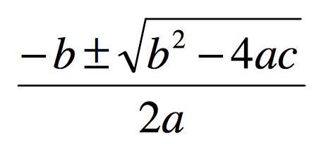
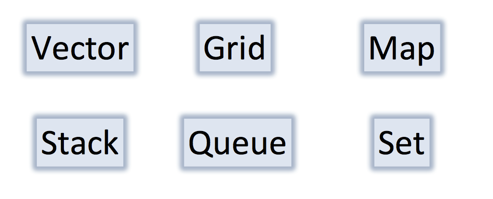
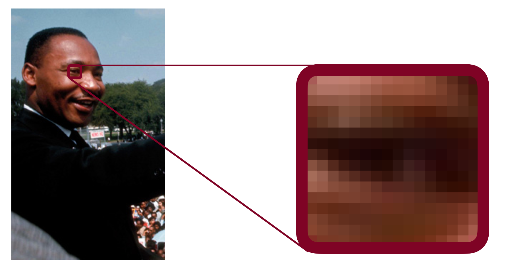
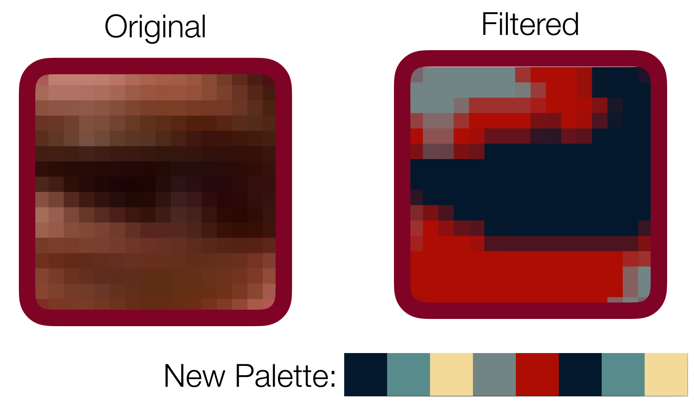

***

### **The `Vector` and `Grid` Classes**

CS 106B: Programming Abstractions

Spring 2023, Stanford University Computer Science Department

Lecturer: Chris Gregg, Head CA: Neel Kishnani


***

Slide 2

### **Announcements**

- I have posted an extra video on passing values by reference on Canvas (recorded previously). The code for the examples is [here](./ReferenceExamples.zip).
- Section starts this week! Section assignments will be released on Tuesday evening and sections will begin Wednesday morning. **Reminder: All section times are displayed in PDT.**
- If you can no longer make the time to which you’re assigned (or if you were originally unassigned because you did not submit time preferences), go to the [CS198 website](https://cs198.stanford.edu/cs198/auth/default.aspx) and you’ll be able to switch into any section which still has space.
- The [LaIR](https://web.stanford.edu/class/cs106b/lair) is now open – this is a space where you can get live code debugging help from our fleet of awesome section leaders.
- Please make your best effort to save code debugging questions for the LaIR or instructor office hours – while we will offer as much flexibility as we can to answer debugging questions on Ed, we only have a limited capacity to do so, and would like to reserve this for folks that are unable to make any of the synchronous help resources that have been offered.

***

Slide 3

### **Code Mystery**


- In the last lecture, we introduced the idea of a C++ *reference*. What is the output of this code?

  ```c++
  void mystery(int& b, int c, int& a) { 
      a++;
      b--;
      c += a; 
  }
  
  int main() { 
      int a = 5; 
      int b = 2;
      int c = 8;
      mystery(c, a, b);
      cout << a << " " << b << " " << c << endl;
      return 0;
  }
  ```

  Poll:

  ```c++
  A. 5 2 8
  B. 5 3 7
  C. 6 1 8 
  D. 61 13 
  E. other
  ```

***

Slide 4

Poll answer: B

*Note: please don't obfuscate your code like this! :(*

*See the [International Obfuscated C Contest](https://www.ioccc.org/) for much, much worse examples*

***

Slide 5

### **A function for Solving the Quadratic Equation**



- A quadratic equation for variable x is one of the form:

  ```c++
  ax2 + bx + c = 0
  ```

  for some numbers a, b, and c.

- The two roots of a quadratic equation can be found using the quadratic formula above.

- Example: The roots of `x^2 - 3x - 4 = 0` are `x=4` and `x=-1`

- How would we write a function named quadratic to solve quadratic equations?

  - What parameters should it accept?
  - Which parameters should be passed by value, and which by reference?
  - What, if anything, should it return?

- We have choices!

***

Slide 6

### **A Function for Solving the Quadratic Equation**


```c++
/*
 * Solves a quadratic equation ax^2 + bx + c = 0,
 * storing the results in output parameters root1 and root2. 
 * Assumes that the given equation has two real roots.
 */
void quadratic(double a, double b, double c,
               double& root1, double& root2) {
    double d = sqrt(b * b - 4 * a * c);
    root1 = (-b + d) / (2 * a);
    root2 = (-b - d) / (2 * a);
}
```

- How are we "returning" the results? Answer: by using references to variables
- What other choices ccould we have made?

***

Slide 7

### **Collections**




- One of the most powerful aspects of C++ is the ability to have a "collection": we will study the six collections shown above.
- We will talk about all of these as we go through CS 106B, but you will need to use the Vector and Grid classes for assignment 1.

***

Slide 8

### **The Vector Collection**

- What is a `Vector`?
  - It is like a `list` in Python, or an `ArrayList` in Java.
  - It is a list of elements that can grow and shrink.
  - Each element has a place (or index) in the list.
- Important Details
  - The *constructor* creates an empty list (more on constructors soon)
  - The Stanford `Vector` class performs *bounds checks*, meaning that if you try to access an element that is outside the *bounds* of a `Vector`, the program crashes.
  - A `Vector` Knows its size.
  - To use `Vectors`, you `#include "vector.h"`.
- *Under the hood*, a vector is an *array*, which means that in the computer's memory, one value follows the next.

***

Slide 9

### **Creating a Vector**

- You must specify the type of your vector (e.g., `int`, `string`, etc.)

- When a vector is created it is initially empty.

- To create a vector called `vec` that can hold integers (`int`s), we write the following:

  ```c++
  Vector<int> vec; 
  ```

  This calls the *default constructor*, which just means that it initializes and creates (*constructs*) an empty vector for us.

***

Slide 10

### **Adding elements to a vector**

- Here is an example where we create a vector called `magic` and add the numbers `4`, `8`, `15`, and `16` to the vector, and then print out the elment at index `2`:

  ```c++
  Vector<int> magic;
  magic.add(4);
  magic.add(8);
  magic.add(15);
  magic.add(16);
  cout << magic[2] << endl;
  ```

  Output:

  ```c++
  15
  ```

- Notice that the index ordering starts from zero!

- In the computer's memory, our vector is represented by one number after another, as follows:

  ```c++
  index: 0  1  2   3
  value: 4  8  15  16 
  ```

***

Slide 11

### **Vectors have useful functions, like `size()`**

- The following loops through the values in the vector and prints them:

  ```c++
  for(int i = 0; i < magic.size(); i++) {
   cout << magic[i] << endl;
  }
  ```

  Output:

  ```c++
  4
  8
  15
  16
  ```

***

Slide 12

### **A new type of `for` loop: the *for each* loop:**

- The following is a loop that automatically gets the next value in a collection:

  ```c++
  for(int value : magic) {
   cout << value << endl;
  }
  ```

  Output:

  ```c++
  4
  8
  15
  16
  ```

***

Slide 13

### **Vector Functions**

- The following functions are part of the vector collection, and can be useful:
  - `vec.size()`: Returns the number of elements in the vector.
  - `isEmpty()`: Returns `true` if the vector is empty, false otherwise.
  - `vec[i]`: Selects the ith element of the vector.
  - `vec.add(value)`: Adds a new element to the end of the vector.
  - `vec.insert(index, value)`: Inserts the value before the specified index, and moves the values after it up by one index.
  - `vec.remove(index)`: Removes the element at the specified index, and moves the rest of the elements down by one index.
  - `vec.clear()`: Removes all elements from the vector.
- For the exhaustive list, check out the [Stanford Vector class](https://web.stanford.edu/class/cs106b/library/documentation/Vector.html)

***

Slide 14

### **The Grid Container**


- The `Grid` is a Stanford library class for 2-dimensional arrays, like a matrix in math:

  ```c++
  a0	b0	c0
  a1	b1	c1
  a2	b2	c2
  ```

***

Slide 15

### **Grid**

- What is it?
  - Advanced 2D array.
  - Think spread sheets, game boards
- Important Details
  - Default constructor makes a grid of size 0
  - Doesn’t support “ragged right”.
  - Bounds checks
  - Knows its size.
- We *could* use a combination of Vectors to simulate a 2D matrix, but a Grid is easier!

***

Slide 16

### **Grid Example Code**

```c++
Grid<int> matrix(2,2); 
matrix[0][0] = 42;
matrix[0][1] = 6;
matrix[1][0] = matrix[0][1];
cout << matrix.numRows() << endl;
cout << matrix[0][1] << endl;
cout << matrix[1][1] << endl;
```

Prints the number of rows, then the value at r0,c1, then the value at r1,c1:

```c++
2
6
0
```

```c++
cout << matrix[2][3] << endl;

***
*** STANFORD C++ LIBRARY 
*** An ErrorException occurred during program execution: 
*** Grid::operator [][]: (2, 3) is outside of valid range [(0, 0)..(1, 1)]
***
libc++abi.dylib: terminate_handler unexpectedly threw an exception
15:25:55: The program has unexpectedly finished.
15:25:55: The process was ended forcefully.
```

Grids do bounds checking! If you want to bounds check without crashing, you should call the `grid.inBounds(row, col)` function, which returns `true` if the row and column are in bounds for the grid.

***

Slide 17

### **Grid Functions**

- The following functions are part of the grid collection, and can be useful:
  - `grid.numRows()`: Returns the number of rows in the grid.
  - `grid.numCols()`: Returns the number of columns in the grid.
  - `grid[i][j]`: selects the element in the ith row and jth column.
  - `grid.resize(rows, cols)`: Changes the dimensions of the grid and re-initializes all entries to their default values.
  - `grid.inBounds(row, col)`: Returns `true` if the specified row, column position is in the grid, `false` otherwise.
- For the exhaustive list, check out the [Stanford Grid class](https://web.stanford.edu/class/cs106b/library/documentation/Grid.html)

***

Slide 18

### **Grid Example: Traversing a Grid**

```c++
void printGrid(Grid<char> &grid) {
    for(int r = 0; r < grid.numRows(); r++) {
        for(int c = 0; c < grid.numCols(); c++) {
            cout << grid[r][c];
        }
        cout << endl;
    }
}
```

***

Slide 19

### **Common pitfalls when working with collections in C++**

- **Vector** **numbers**
  - Needs a type! Should be: `Vector<int> numbers;`
- **void** **myFunction**(Grid<bool> **gridParam**);
  - Two issues:
    - If you want the original `gridParam` to be changed in the calling function, you're out of luck.
    - Inefficient because you have to make a copy of `gridParam`.

```c++
void printOutGrid(Grid<bool> & grid) {
    for(int i = 0; i < grid.numRows(); i++) {
        for(int j = 0; j < grid.numCols(); j++) {
            cout << grid[j][i];
        }
    }
}    
```

- Watch your variable ordering! Better to use `r` for rows, and `c` for columns.

***

Slide 20

### **Let's Code Instagram!**


***

Slide 21

### **A color is an `int`, and and Image is just a `Grid<int>`!**



***

Slide 22

### **Let's change the palette of the image**



***

Slide 23

### **Let's Code!**


***

